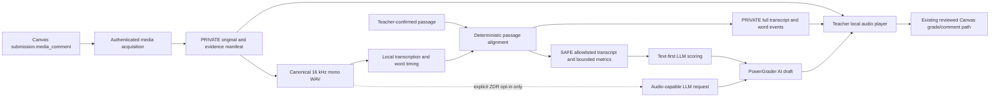

# Media-recording read-aloud scoring initiative

**Status:** Senior context. Batches A and B are accepted GREEN under the user-authorized
synthetic-only verification override. Batch C is the next candidate for direct-brief promotion.

**Baseline inspected:** local `dev` at `450e97ffd97e6312adc185b535ae46cd7b8cbf81`
on 2026-08-07. The working tree already contains unrelated user changes in
`Open Canvas Expert.bat`, `Repair.bat`, and
`api/default_docs/AI Authoring/START HERE - CanvasAgent.txt`; preserve them.

**Next batch pointer:** Batch C, using sections 1-7, 9.3, 10.1, 11, and 13 of this plan. Batches
A and B were accepted on 2026-08-07 under the explicit synthetic-only override because no dummy
or live courses exist. The documented `MediaComment` source shape is implemented and fails closed
on unknown transport behavior; direct media URL and signed cross-origin behavior remain a later
integration risk, not a reason for compatibility code.

This is persistent senior planning context. It does not itself authorize implementation.
Terra promotes exactly one batch at a time into the single direct brief under
`docs/handoffs/`, locking the then-current baseline, exact files and symbols, named gate,
and stop conditions. A single Luna executor writes each batch. Other Luna agents may perform
bounded read-only research, adversarial review, or verification, but they do not edit an
overlapping surface concurrently.

## 1. Teacher outcome

A teacher can select an ordinary Canvas assignment whose submitted work is a Canvas media
recording, open a PowerGrader session, listen to each student's read-aloud locally, inspect a
time-aligned transcript and conservative passage comparison, receive an AI draft score and
feedback, and approve or edit the result through the existing PowerGrader review and Canvas
write path.

The teacher-visible experience must answer four questions without leaving PowerGrader:

1. Did Canvas Expert acquire the complete recording for this exact submission attempt?
2. What passage did Canvas Expert compare it with?
3. What did the local speech and alignment pipeline observe, including uncertainty?
4. What did the AI suggest, and what did the teacher finally approve?

No recording, transcript, metric, or AI result is an integrity judgment. AI scoring remains a
draft. A failed or uncertain acquisition is visibly held for teacher review rather than
represented as an empty response or a completed analysis.

## 2. Current repository truth

The reusable back half is already strong:

- PowerGrader recognizes `media_recording` as a gradable assignment submission type in
  `api/webui/static/powergrader/setup_core.js`.
- `api/powergrader/canvas_fetch.py` forces non-text-only assignments through a live Canvas
  submission fetch rather than serving a text-only mirror projection.
- Ordinary file uploads already have authenticated download, private managed originals,
  evidence manifests, size checks, fail-closed eligibility, metadata-stripped image
  derivatives, SAFE/PRIVATE artifact separation, pseudonym assignment, name scrubbing, and
  isolated per-student AI failures.
- `docs/contracts/feedback-scoring-contract.md` already defines the pseudonym/item result
  seam. Imported or API-produced results are re-identified locally, remain drafts, and use
  PowerGrader's review, preflight, idempotency, verification, and receipt path.

The missing front half is concrete:

- Canvas represents a submitted recording under `submission.media_comment`, not as an
  ordinary `submission.attachments` row.
- `canvas_fetch.ingest_ordinary_attachments` only iterates `attachments` and therefore never
  acquires the media object.
- `feedback_artifacts.pseudonymize_submissions` drops a submission with no body and no
  attachments.
- `session_builder.build_students` can simultaneously report zero expected attachments as
  eligible, leaving a submitted recording represented as "No text entry body" with no AI
  evidence.
- `openrouter_client` currently emits text and `image_url` content only and treats every
  response `media` entry as an image.
- `scoring_packet.build_packet` intentionally holds media-only responses because it exposes
  only text rows.
- `autoscore_queue.UNSUPPORTED_TYPES` explicitly includes `media_recording`.
- No audio decoder, transcriber, passage aligner, local audio player, audio capability/price
  gate, raw-audio privacy control, or media-recording test exists.

The present fall-through was reproduced with a synthetic media submission: the SAFE bundle
contained zero students while attachment eligibility returned `eligible=True` for zero
expected and zero present attachments. Batch A must eliminate that state before any AI work.

## 3. Locked product and architecture decisions

### 3.1 Scope is ordinary Canvas media submissions

The first supported source is the ordinary Canvas assignment submission type
`media_recording`. The implementation reads the actual submission's `submission_type`; it does
not assume every student used media merely because the assignment offered media among several
submission options.

Canvas audio recordings and Canvas video recordings are both accepted as input. Video is kept
as the private original, but the analysis and outbound evidence use only its audio track. Video
frames are out of scope because the teacher's stated need is read-aloud scoring and sending
images of children would expand the privacy boundary without improving that outcome.

Classic Quizzes, New Quiz media/file items, submission comments containing recordings, Studio
assignments, external-tool recordings, discussion attachments, and arbitrary online URLs are
not part of the initial lane.

### 3.2 Local-first speech processing is the default

The default path keeps the student's raw voice on the teacher's machine:

1. download the Canvas media privately;
2. create a canonical local audio derivative with identifying container metadata removed;
3. transcribe locally;
4. compare the transcript with the teacher-confirmed passage locally;
5. send only the pseudonymized transcript, bounded comparison evidence, rubric, and source
   passage to the scoring LLM;
6. let the teacher verify the draft while listening to the private local audio.

Raw audio transmission is a separate opt-in delivered only in Batch D. It is never silently
enabled because a model happens to accept audio.

### 3.3 The comparison passage is explicit teacher-owned input

An oral-reading analysis requires exactly one teacher-confirmed passage. PowerGrader may offer
the assignment description or an existing selected source material as a starting point, but it
must not silently infer the authoritative passage from assignment HTML, a module page, a file
collection, or the student's transcript.

The setup surface stores the confirmed passage and its SHA-256 digest in the private session.
The SAFE bundle may contain the scrubbed passage text and digest. If the passage is missing,
empty, too large, or changed after a saved analysis, the student is held from oral-reading AI
scoring until the teacher confirms and reruns the analysis.

Initial limits:

- English read-alouds only;
- at most 3,000 normalized source words;
- one passage per PowerGrader session;
- no automatic lexile, phoneme, language-detection, or reading-level judgment.

### 3.4 Verification is deterministic evidence, not an LLM verdict

The local oral-reading engine owns the observable comparison. It produces:

- recording duration;
- locally transcribed text and word timing/confidence when available;
- source-word count and spoken-word count;
- matched words;
- substitution, omission, and insertion candidates;
- completion percentage;
- conservative accuracy percentage;
- words correct per minute;
- pause summary derived from word timing;
- repetition and self-correction candidates;
- an uncertainty summary and a status of `complete`, `needs_review`, or `unavailable`.

These are evidence fields, not a final score. A self-correction candidate is never silently
counted as correct or incorrect; the rubric or teacher decides. Low-confidence speech is
marked, not converted into a student error. The LLM may draft a rubric score from the evidence,
but it may not invent word-level counts, claim speaker identity, infer disability, or turn ASR
uncertainty into a reading deficit.

Prosody, expression, pronunciation quality, and voice affect are not claimed from transcript
metrics. They remain teacher-reviewed unless Batch D's explicit raw-audio lane is enabled for
an audio-capable model. Even then, the output remains a draft.

### 3.5 One private original and one canonical analysis derivative

For every submitted media recording, the evidence state is exactly one of:

- `ready`: one complete private original, one validated canonical audio derivative, and a
  matching digest;
- `held`: submitted media exists but acquisition, validation, conversion, or analysis is
  incomplete;
- `not_media`: the student's actual submission type is something else and follows its existing
  lane.

The private original may live in the existing real-student/attempt evidence tree. It may retain
the Canvas media ID and original display metadata needed for local traceability. No Canvas URL,
authorization header, signed URL, or cookie is ever persisted.

The canonical audio derivative is PCM16 mono WAV at 16 kHz. Conversion removes video tracks,
cover art, chapters, and all source metadata. It must not trim silence, alter tempo, normalize
away pauses, or otherwise change timing used by fluency evidence. It receives a synthetic local
name based on the private evidence digest, never the original filename.

The optional SAFE audio copy uses only a pseudonym/generic ordinal and `.wav`, for example
`Reader-One__audio-1.wav` or the existing compact hash layout. Its JSON metadata contains no
real name, Canvas/SIS/user/submission/media ID, source URL, original display name, private path,
course roster label, or original container tags.

Initial resource limits are explicit and fail closed:

- 100 MiB maximum downloaded source per student;
- 15 minutes maximum recording duration per student;
- 500 MiB maximum downloaded media per class run;
- at most two concurrent media downloads/conversions;
- streamed download to a `.partial` file followed by verified atomic finalization;
- no silent truncation, down-selection, or reuse when the evidence identity/digest changed.

### 3.6 Voice is identifying even after filename and metadata cleanup

The product always describes outbound audio as pseudonymized, never anonymous or FERPA-safe.
A child's voice and spoken content can identify the child. Metadata stripping does not change
that fact.

Before Batch D may send raw audio externally:

- the teacher must explicitly opt in for that session;
- the local transcript must exist and pass the existing roster-name/protected-name safety scan;
- a detected spoken roster identifier holds the raw audio locally rather than attempting audio
  redaction;
- the exact OpenRouter model must advertise audio input;
- the request must set `provider.zdr = true` and
  `provider.data_collection = "deny"`;
- provider fallbacks that do not satisfy those policies are unavailable;
- request pricing must be verifiable before the send;
- raw/base64 audio must never enter debug files, operational logs, receipts, exception strings,
  or saved request bodies;
- one student's audio is sent per request so a provider failure is isolated.

If any condition is unavailable or uncertain, transcript-first scoring remains available and
the raw audio is not sent.

### 3.7 The existing scoring result contract remains the write seam

The outbound SAFE input contract gains an optional `oral_reading` evidence object. The LLM
result remains the existing `pseudonym`, `item_id`, `score`, and `feedback` shape. This avoids a
second result/import/write system.

Oral-reading observations and metrics remain attached to the private session and teacher UI.
They are never copied into Canvas comments unless the teacher explicitly edits the student
feedback to include them. They never enter a Canvas receipt or idempotency key.

`feedback-scoring-contract.md` may receive an additive optional input field; the result
contract version remains `1.0` unless implementation proves a breaking change is unavoidable.
A breaking result change is a RED stop and senior decision, not an executor choice.

### 3.8 Review-first remains mandatory

The initial interactive feature produces AI drafts only. Score, feedback, transcript evidence,
and the private audio are shown together before approval. The existing PowerGrader reviewed
grade/comment path remains the only ordinary Canvas write owner.

Interactive automatic posting is disabled for a session containing a media-recording
submission throughout this initiative. Scheduled automatic posting of media-derived scores is
an explicit non-goal. Real use may justify a later senior decision, but successful code tests do
not authorize it.

### 3.9 Packet, Copilot, and MCP are transcript-first

Packet folders, loose AI-chat batch files, and MCP scoring packets receive the scrubbed passage,
transcript, metrics, bounded difference candidates, and uncertainty status. They do not receive
raw audio in the initial implementation.

Do not revive a teacher-facing ZIP workflow. Existing AI-chat batches stay loose-file based.
MCP remains JSON/text only; no binary media read tool, base64 field, private local path, or public
media URL is added.

### 3.10 Local runtime dependencies are explicit and machine-local

The planned local transcriber is `faster-whisper` using the English `small.en` model on CPU. The
implementation must prove import and a short inference under the repository's Python 3.14
runtime before this dependency is committed. Tests stub the model and never download weights.

The model weights live in a machine-local cache outside the repo and outside OneDrive. They are
downloaded only through an explicit teacher/developer setup action with the approximate size
shown first; normal PowerGrader use never initiates a silent model download.

Canonical audio conversion uses an installed `ffmpeg`/`ffprobe`. This target machine currently
has both, but the repository does not declare them. Add a read-only capability check and a
machine-local override such as `CANVAS_EXPERT_FFMPEG_PATH`; do not bundle a media executable,
install software, change `PATH`, or put a developer-specific path in source.

If `faster-whisper`, its native dependencies, or the chosen model cannot run reliably on Python
3.14/Windows without downgrading the app runtime, stop RED. Do not add a second Python runtime or
an opaque background service as an executor workaround.

### 3.11 Clean break, no legacy media shapes

Canvas Expert is pre-launch. Introduce one current media evidence shape and update all immediate
consumers. Do not add dual-read compatibility, legacy keys, schema migrations, or fallback
parsers for media session records that have never existed.

## 4. End-to-end architecture



Ownership stays narrow:

| Concern | Owner/insertion point | Boundary |
| --- | --- | --- |
| Canvas submission and media-source transport | `api/powergrader/canvas_fetch.py` | URLs and auth remain in memory only |
| Media normalization, validation, conversion, duration, hashes | new `api/powergrader/media_recordings.py` | Canvas-free after bytes/local path enter the module |
| Focused evidence manifest | `api/powergrader/assignment_refresh.py` | Private IDs/digests allowed; SAFE data forbidden |
| Session projection | `api/powergrader/session_builder.py` | Private review metadata, no transport URL |
| Local speech and alignment | new `api/powergrader/oral_reading.py` | Deterministic, offline-testable, no Canvas or LLM imports |
| SAFE/PRIVATE artifact construction | `api/feedback_artifacts.py` | Allowlist rebuild, scrub, hard safety gate |
| LLM request and pricing | `api/openrouter_client.py`, `api/ai_transmission.py` | Modality/price/privacy gate before bytes leave |
| Packet/Copilot/MCP text projection | `api/powergrader/packet.py`, `copilot_packet.py`, `scoring_packet.py` | Transcript/metrics only, no binary/path/URL |
| Teacher rendering and controls | `powergrader_queue.html`, `queue_core.js`, new narrow queue feature file | Local playback plus evidence and AI draft |
| Canvas writeback | existing `api/powergrader/session_actions.py` | Do not add a media-specific write transport |
| Scheduled policy | `api/powergrader/autoscore_queue.py` and routines route | Remains unsupported until Batch E; no auto-post |

Do not create a general media registry, cross-product transcription service, provider adapter
hierarchy, or durable job framework. These two immediate consumers, PowerGrader read-aloud
analysis and its SAFE artifact, justify the two new modules above. Nothing broader does.

## 5. Data contracts

### 5.1 Private media evidence record

The normalized private record is a list under `submission["media_recordings"]`, even though
Canvas currently supplies one submitted recording. The list avoids special scalar handling while
not promising multiple Canvas media comments.

Required shape after acquisition:

```json
{
  "evidence_kind": "media_recording",
  "media_type": "audio",
  "canvas_media_id": "PRIVATE_ONLY",
  "source_content_type": "audio/mp4",
  "source_display_name": "PRIVATE_ONLY",
  "attempt": 1,
  "item_id": "assignment-id",
  "download_status": "downloaded",
  "conversion_status": "converted",
  "local_path": "PRIVATE_ONLY",
  "canonical_audio_path": "PRIVATE_ONLY",
  "actual_size": 12345,
  "duration_seconds": 74.2,
  "source_sha256": "hex",
  "canonical_sha256": "hex",
  "warnings": []
}
```

`canvas_media_id`, display name, paths, and content indicators are private. Session projections
copy only fields needed for review. SAFE builders never filter this dict; they construct a new
allowlisted object.

### 5.2 Private oral-reading report

`oral_reading.py` returns a versioned report containing the passage digest, model identity,
model/version, full transcript, full word events, normalized source tokens, dynamic-programming
alignment, metrics, warnings, and evidence digests. It lives only in the private session/evidence
tree and may be regenerated from the private original and confirmed passage.

The report must record enough version information to explain a future rerun, but no migration is
required. A changed engine/model creates a new analysis result for a new session or explicit
rerun.

### 5.3 SAFE oral-reading projection

The SAFE projection is rebuilt from a whitelist and attached to the existing response item:

```json
{
  "item_id": "assignment-id",
  "prompt": "Read the confirmed passage aloud.",
  "response": "Pseudonymized local transcript text",
  "possible": 10,
  "oral_reading": {
    "version": "1.0",
    "passage_digest": "hex",
    "evidence_digest": "hex",
    "duration_seconds": 74.2,
    "status": "needs_review",
    "metrics": {
      "source_words": 180,
      "spoken_words": 177,
      "matched_words": 168,
      "substitution_candidates": 4,
      "omission_candidates": 8,
      "insertion_candidates": 5,
      "completion_percent": 96.1,
      "accuracy_percent": 93.3,
      "wcpm": 135.8,
      "pause_count": 7
    },
    "uncertainty": {
      "low_confidence_word_count": 9,
      "difference_candidates_truncated": false
    },
    "difference_candidates": [
      {
        "kind": "substitution",
        "expected": "synthetic",
        "observed": "example",
        "start_seconds": 12.4,
        "end_seconds": 12.9,
        "confidence": 0.58
      }
    ]
  }
}
```

Constraints:

- at most 100 difference candidates;
- no raw word-event list in SAFE;
- an overflow sets `difference_candidates_truncated=true` and `status=needs_review`;
- transcript, passage, and observed/expected words pass the existing scrub and survivor scan;
- timestamps are relative offsets, not wall-clock times;
- no filenames or local paths unless Batch D creates a separate approved SAFE audio item;
- no score is computed in this object.

### 5.4 Evidence binding

The SAFE `evidence_digest` covers canonical-audio SHA-256, passage digest, transcription model
identity/version, normalization/alignment version, transcript, metrics, and difference candidates.
Packet digest/import validation therefore binds an AI result to the exact analyzed evidence.

The private session submission baseline also stores attempt, submitted-at, and private media
identity/digest. A new attempt or changed media identity invalidates the analysis and cannot reuse
the prior AI draft.

## 6. Teacher workflow

1. Teacher selects a PowerGrader assignment.
2. If actual submitted work includes media recordings, setup shows a required Read-aloud passage
   section.
3. Teacher confirms one passage, rubric, scoring mode, and whether raw audio may leave the
   computer. Raw audio defaults off.
4. PowerGrader performs focused Canvas acquisition and shows per-student progress/status.
5. Local conversion and speech analysis run with per-student isolation.
6. Students with complete text-first evidence enter the AI scoring lane. Held students still
   enter the teacher queue with an explanation and local/SpeedGrader fallback.
7. Queue shows local audio controls, passage, transcript/alignment summary, uncertainty, AI draft,
   and teacher score/feedback together.
8. Teacher approves or edits through the existing save/review/push flow.

The setup and queue remain professional work surfaces. Do not add marketing copy, a walkthrough
carousel, celebratory completion UI, or a privacy banner that displaces the controls. Put the
decision and status next to the action it governs.

## 7. Privacy and safety laws

These are direct laws, each tested once at its owner:

1. Every submitted `media_recording` is either represented by complete media evidence or visibly
   held. It can never become zero expected evidence plus eligible.
2. Canvas authentication, cookies, signed URLs, and media source URLs never reach disk, session
   JSON, SAFE artifacts, logs, receipts, tests, or browser payloads.
3. SAFE media/transcript artifacts contain no real name, student Canvas/SIS/user/submission/media
   ID, original display name, or private path.
4. The private original is never overwritten by conversion or analysis.
5. Canonical conversion preserves timing and strips all container metadata.
6. An analysis is bound to exact media, passage, model, and engine versions by digest.
7. Low-confidence ASR is visible uncertainty, not an automatically assigned student error.
8. Raw audio cannot leave the machine without per-session teacher opt-in, a clean local transcript
   scan, audio-capable exact model, verified pricing, ZDR, and denied data collection.
9. Raw/base64 audio never enters diagnostic or operational logging.
10. AI results remain drafts and use the existing PowerGrader write boundary.
11. Media sessions cannot enable interactive or scheduled automatic posting.
12. A stale/new Canvas attempt cannot reuse the prior analysis or AI draft.

## 8. Terra/Luna execution model

Terra owns initiative-level architecture, batch promotion, integration, and acceptance. For each
batch:

1. Terra reads this plan, current project state, the current PowerGrader route cards, and only the
   exact sections needed for that batch.
2. Terra performs the batch preflight, locks the direct brief, and names one Luna implementation
   executor.
3. The Luna executor reads `AGENTS.md`, the direct brief, and only its routed references; it
   implements the entire batch and writes the compact `Execution result` into the direct brief.
4. A second Luna may adversarially review the diff against the locked laws and acceptance criteria
   without editing. A third Luna may run the named gate/browser verification without editing.
5. Corrections return to the same implementation Luna. Do not replace the executor for routine
   repair.
6. Terra accepts only from evidence, updates the durable route card/contract, retires a GREEN direct
   brief, and leaves the next batch pointer in this plan.

No two Luna agents edit the same working tree surface concurrently. If independent worktrees are
used, Terra still integrates one batch commit at a time and re-runs only the gate invalidated by the
integration diff.

Suggested bounded Luna roles:

- **Canvas transport reviewer:** sanitized dummy-response shape, redirect/auth behavior, source
  selection, and no-persistence audit.
- **Media/speech executor:** conversion, hashes, transcription adapter, alignment engine, and unit
  fixtures.
- **Privacy/adversarial reviewer:** SAFE allowlist, spoken-name gate, log scanning, packet/MCP shape,
  and negative tests.
- **Browser verifier:** setup/queue rendering, audio playback/range requests, held states, controls,
  and console errors.

These are roles, not permission to split a single batch across concurrent writers.

## 9. Batch plan

### 9.1 Batch A: acquire and review Canvas media privately

**Teacher-visible outcome:** A media-recording submission opens in PowerGrader with a playable
local recording or a specific held reason. It is no longer represented as empty/eligible work.
No AI, transcription, or SAFE audio leaves the machine in this batch.

**Required preflight before writing:**

1. Use one teacher-created dummy media submission with no real student data.
2. Record only a sanitized structural trace: present keys, content types, byte sizes, redirect host
   class, and status codes. Do not store the media ID, URL, user ID, course ID, or audio in the repo.
3. Prove whether `submission.media_comment.url` is a downloadable source. If not, prove the exact
   course Media Objects lookup/source selection path and permissions.
4. Confirm signed cross-origin downloads work without forwarding Canvas authorization to the media
   host.
5. Confirm `ffmpeg` and `ffprobe` capability discovery on the target Windows machine.
6. Prove `faster-whisper` can install/import under Python 3.14 in an isolated temporary environment;
   do not add it to requirements yet and do not download model weights in this batch.

**Implementation scope:**

- new `api/powergrader/media_recordings.py`;
- `api/powergrader/canvas_fetch.py` media-comment normalization and authenticated/signed download;
- `api/powergrader/assignment_refresh.py` evidence manifest integration;
- `api/powergrader/session_builder.py` private review projection and exact evidence expectation;
- `api/powergrader/late_catchup.py` only if needed to preserve data shape, not to run late media AI;
- PowerGrader queue template/core plus one narrow `queue_media_recording.js` feature file;
- one local-only, session-addressed audio streaming route with workspace containment, evidence
  ownership validation, MIME type, Range support, and no-cache headers;
- route registration/load order and route contract;
- route cards documenting the new evidence owner.

**Acceptance criteria:**

1. A synthetic audio `media_comment` becomes exactly one private media evidence record.
2. A synthetic video `media_comment` preserves the private original and produces an audio-only
   canonical derivative.
3. No URL/auth value survives normalization, manifest writing, session building, or error handling.
4. Missing media ID/source, expired URL, redirect-policy failure, size overflow, interrupted
   download, invalid container, missing audio track, excessive duration, and ffmpeg absence each
   produce a stable held reason.
5. A submitted media recording can never have an evidence expectation of zero.
6. Manifest status is `current` only when every expected media item is finalized and digest-bound.
7. Reuse requires matching stable media identity/content indicator and existing verified bytes.
8. The queue plays the canonical local audio and shows duration/status without exposing a local
   filesystem path to browser script.
9. The stream route rejects traversal, a record outside the requested session/student, incomplete
   files, and non-workspace paths.
10. Score-myself mode remains usable; assisted/packet mode shows that AI analysis is not yet
    available rather than scoring empty work.

**Named gate:**

```powershell
py -m pytest api/tests/powergrader/test_media_recordings.py api/tests/test_powergrader_attachment_workflow.py api/tests/test_route_contract.py -q -p no:randomly --tb=short
```

Render `/powergrader` and one synthetic media queue session. Verify player seek/play, held states,
all required globals, and zero new browser console errors.

**Stop conditions:** Stop RED if the teacher PAT cannot obtain a stable downloadable media source;
if access requires scraping SpeedGrader/player HTML, forwarding credentials to an untrusted host,
or retaining a browser session cookie; if conversion requires installing/changing system software;
or if the audio stream cannot be scoped to session-owned workspace evidence.

### 9.2 Batch B: local transcript and passage verification

**Teacher-visible outcome:** A complete recording receives a local transcript, passage comparison,
metrics, uncertainty status, and time-addressable teacher review. Nothing is sent externally.

**Implementation scope:**

- new `api/powergrader/oral_reading.py` with pure normalization/alignment functions and a narrow
  `faster-whisper` adapter;
- machine-local speech model path/status and explicit setup action, with no silent download;
- private report persistence and session projection;
- setup passage confirmation and digest;
- queue transcript/source comparison and time links into the audio player;
- durable `docs/contracts/oral-reading-evidence-contract.md` defining private and SAFE shapes,
  metrics, uncertainty, limits, and non-claims;
- dependency update only after the Python 3.14 preflight is GREEN.

**Acceptance criteria:**

1. Pure alignment fixtures cover exact reading, omission, insertion, substitution, repetition,
   likely self-correction, early stop, and empty/unintelligible audio.
2. Normalization rules are deterministic and versioned. Punctuation/case normalization does not
   erase apostrophes or create words not present in source/transcript.
3. WCPM uses matched words and actual untrimmed recording duration; division-by-zero and extreme
   duration fail safely.
4. Word confidence and timing remain observations. Low confidence changes status/flags, never the
   source transcript or student score.
5. Passage change or media digest change invalidates the cached report.
6. Missing model, missing passage, failed inference, unsupported language, excessive source length,
   and difference overflow are visible and recoverable.
7. Tests never download a model, access Canvas, or include real student speech.
8. One synthetic or public-domain spoken fixture verifies the real local adapter end to end outside
   the normal unit gate.
9. The queue lets the teacher play from a difference timestamp and clearly separates observed
   evidence from teacher/AI scoring.

**Named gate:**

```powershell
py -m pytest api/tests/powergrader/test_oral_reading.py api/tests/powergrader/test_media_recordings.py api/tests/test_webui_template_contracts.py -q -p no:randomly --tb=short
```

Render the setup passage state and queue comparison for `complete`, `needs_review`, and
`unavailable`, with zero new console errors.

**Stop conditions:** Stop RED if the local dependency requires a Python downgrade/second runtime,
silently downloads model weights during grading, cannot provide stable word timing/confidence, or
cannot process a representative short child-like/public-domain sample within a usable local wait.

### 9.3 Batch C: transcript-first SAFE artifacts and AI drafts

**Teacher-visible outcome:** Packet and assisted sessions can score pseudonymized read-aloud
transcripts/metrics, return an AI draft, and show that draft beside the local verification evidence.
Raw audio remains local.

**Implementation scope:**

- SAFE whitelist/projection in `api/feedback_artifacts.py`;
- additive oral-reading input contract and scoring instructions in `api/feedback_contract.py` and
  `docs/contracts/feedback-scoring-contract.md`;
- `api/powergrader/ai_workflow.py` and packet artifacts;
- loose AI-chat batch projection in `copilot_packet.py`/support;
- text-only MCP projection in `scoring_packet.py`;
- import binding through the existing packet digest/result validator;
- AI suggestion and local evidence composition in the queue;
- route-card updates naming the privacy and scoring owner.

**Scoring instruction laws:**

- use only the supplied rubric and evidence;
- treat all counts as candidates when status is not `complete`;
- do not claim pronunciation, expression, or prosody from transcript-only evidence;
- do not infer identity, disability, effort, intent, cheating, or diagnosis;
- do not turn low ASR confidence into a reading error;
- return the existing score/feedback result shape only.

**Acceptance criteria:**

1. SAFE artifacts contain the pseudonym, scrubbed passage/transcript, allowlisted metrics,
   uncertainty, and at most 100 difference candidates.
2. Private-only fields, filenames, paths, Canvas/media IDs, full word events, and model cache paths
   are absent by construction.
3. A survivor name in passage, transcript, or difference candidates excludes/holds that student
   under the existing privacy gate.
4. Packet, loose AI-chat batch, MCP packet, and direct text-first assisted request communicate the
   same metrics/status and output contract.
5. No packet or MCP output contains raw/base64 audio or a path/URL to audio.
6. Imported results must match pseudonym, item, packet digest, and exact oral-reading evidence.
7. A media student excluded from SAFE remains in the private teacher queue with a reason.
8. The ordinary result import/re-identification/review/write path passes unchanged.
9. Interactive auto-post remains unavailable for the session.

**Named gate:**

```powershell
py -m pytest api/tests/test_feedback_pipeline.py api/tests/powergrader/test_packet.py api/tests/powergrader/test_copilot_packet.py api/tests/test_scoring_packet_mcp.py api/tests/test_openrouter_client.py api/tests/test_powergrader_attachment_workflow.py -q -p no:randomly --tb=short
```

Batch C is an explicit integration checkpoint. After the focused gate passes, run:

```powershell
py -m pytest api/tests -q -p no:randomly --tb=short
```

Baseline unrelated failures once in the direct brief before implementation. Render `/powergrader`
and the affected queue route with packet and assisted synthetic sessions and zero new console
errors.

**Stop conditions:** Stop RED if supporting oral-reading evidence requires a second result schema,
bypasses import validation, exposes audio over MCP, weakens the safety scan, or changes Canvas
writeback semantics.

### 9.4 Batch D: explicit raw-audio OpenRouter opt-in

**Teacher-visible outcome:** A teacher may explicitly allow one assisted session to send
pseudonymized, metadata-stripped audio to an exact audio-capable model for qualitative audio-aware
drafting. Transcript-first scoring remains the default and fallback.

**Implementation scope:**

- modality-aware media records in `openrouter_client` rather than treating all media as images;
- `input_audio` request construction from the canonical SAFE WAV;
- audio-capability and duration/format checks;
- duration-aware cost estimate or a conservative blocking result when price cannot be verified;
- per-request ZDR and denied data collection;
- exact-model/no-ineligible-fallback routing;
- local transcript roster-name gate;
- explicit setup opt-in and queue/audit status;
- sanitized failures and regression scan proving request audio cannot reach logs/debug files.

**Acceptance criteria:**

1. Raw audio defaults off for every session and cannot be enabled by stored global preference.
2. Opt-in is scoped to one new assisted session and recorded without student content.
3. Non-audio model, unknown model metadata, unsupported format/duration, unavailable pricing,
   failed transcript scan, detected roster name, or ZDR-ineligible provider blocks the raw send and
   leaves transcript-first/manual review available.
4. The request contains generic text plus one `input_audio` object for exactly one pseudonymized
   student; it contains no original filename/path/URL/Canvas ID.
5. `provider.zdr=true` and `provider.data_collection="deny"` are present and required.
6. Base64 audio does not appear in any persisted artifact, audit, exception, mocked request log, or
   debug file.
7. Audio students continue to be sent one per request and failures remain isolated.
8. The scoring prompt distinguishes what can be observed from audio from what remains uncertain,
   and output still validates against the ordinary result contract.
9. UI language says pseudonymized, not anonymous, and identifies that voice content leaves the
   computer for this session.

**Named gate:**

```powershell
py -m pytest api/tests/test_openrouter_client.py api/tests/test_beta075_transmission.py api/tests/test_feedback_safety.py api/tests/test_powergrader_attachment_workflow.py api/tests/test_webui_template_contracts.py -q -p no:randomly --tb=short
```

Render setup opt-in, blocked-model, blocked-name, and successful synthetic request states with zero
new console errors. Do not send a real student recording in acceptance testing.

**Stop conditions:** Stop RED if OpenRouter cannot enforce ZDR/data-collection denial for the exact
audio request, if audio pricing cannot be bounded before sending, if the chosen provider requires a
public URL, or if any diagnostic path can persist request audio.

### 9.5 Batch E: late-catch-up and scheduled draft coverage

**Entry condition:** At least one teacher-reviewed class-scale interactive run has completed, the
teacher confirms the evidence/UI are usable, and no unresolved privacy or acquisition defect
remains. Code completion alone does not satisfy this condition.

**Teacher-visible outcome:** Late submissions and a specifically opted-in scheduled job may create
or refresh local oral-reading AI drafts for later teacher review. They do not automatically post.

**Implementation scope:**

- all student-building paths named in the PowerGrader route card: initial, late catch-up, and
  routines;
- media acquisition/reuse under the existing focused evidence owner;
- `autoscore_queue` classification updated only for draft-scoring eligibility;
- job snapshot includes confirmed passage digest and local/raw-audio policy;
- stale attempt/media/passage/model evidence reopens review rather than reusing a draft;
- no automatic-post policy expansion.

**Acceptance criteria:**

1. Initial, late, and routine paths attach the same media and oral-reading shapes in the same
   order before session building.
2. A late new attempt receives new evidence and cannot reuse the prior transcript/result.
3. A scheduled job without a confirmed passage, local model, media capability, current evidence,
   or writable private receipt area becomes `needs_attention` without a paid call.
4. Scheduled raw audio is off unless that exact job has its own explicit opt-in and every Batch D
   gate passes; a global/session preference cannot authorize it.
5. Scheduled media results always land as drafts in PowerGrader. `auto_push` remains blocked for
   media-recording work.
6. Existing text/upload autoscore behavior remains unchanged.

**Named gate:**

```powershell
py -m pytest api/tests/powergrader/test_late_catchup.py api/tests/powergrader/test_autoscore_queue.py api/tests/test_powergrader_scheduled_autoscore.py api/tests/test_powergrader_attachment_workflow.py -q -p no:randomly --tb=short
```

Batch E is the release checkpoint for this initiative. After the focused gate, run the full API
suite and affected browser routes once.

**Stop conditions:** Stop RED if scheduled draft scoring cannot be separated from automatic posting,
if a job can spend money before media/readability/privacy preflight, or if any builder path would
need a parallel media implementation.

## 10. Verification and test discipline

### 10.1 Test taxonomy decisions for this initiative

Use function-style tests. Do not introduce test classes; the repository overwhelmingly uses
functions and the global house-style question remains unresolved elsewhere.

Every named command disables `pytest-randomly` with `-p no:randomly` for reproducibility. This plan
does not decide whether the plugin stays enabled globally.

Tests are exactly one of:

- **Law:** one direct test per privacy/evidence/write law in section 7.
- **Contract:** parameterized over supported media types/statuses or artifact projections from the
  defining list/registry.
- **Example:** one end-to-end happy path per delivered batch.

Do not multiply happy paths across wrappers. Do not prove browser behavior with source-text tests.

### 10.2 Synthetic fixtures

Repository fixtures contain no student data. Generate tiny deterministic media fixtures during
tests or keep a clearly synthetic/public-domain sub-second WAV with no human identity. If a binary
fixture is committed, document its origin/license and keep it minimal. Do not commit the live dummy
Canvas recording or a real child's voice.

The real local-adapter check uses a temporary/private file outside the repo and reports only
duration, status, and timing. It is not part of the ordinary deterministic unit gate.

### 10.3 Browser verification

Any batch changing templates, queue scripts, shared playback, or safety controls loads every
affected route in the local app. At minimum verify:

- setup with no media students, media students, missing passage, and missing local dependency;
- queue ready, held, needs-review, and AI-draft states;
- play, pause, seek, and timestamp jump;
- student navigation stops/changes the active recording correctly;
- no recording from the previous student continues playing after navigation;
- controls work with keyboard focus;
- zero new browser console errors;
- no private path, Canvas URL, ID, or auth value appears in DOM, network response JSON, or console.

### 10.4 Live verification boundary

Only Batch A requires a live Canvas read, and only against a teacher-created dummy media submission.
No agent creates a submission, changes Canvas configuration, downloads real student work, or posts a
grade as part of acceptance. Later live teacher use is user-driven and reviewed.

## 11. Risks and mitigations

| Risk | Mitigation |
| --- | --- |
| Canvas media source differs by Kaltura/configuration | Dummy preflight; transport adapter isolated; stop before scraping/private browser automation |
| Signed media URL expires or redirects cross-origin | Stream immediately; drop Canvas auth on cross-origin; never persist URL; stable private media identity/digest |
| Current 10 MiB attachment budget rejects class audio | Separate explicit media byte/duration budget; streaming and two-worker cap |
| ASR mistakes become student errors | Candidate language, confidence flags, deterministic evidence, teacher review, no auto-post |
| Voice or spoken name identifies student | Local-first default; transcript survivor gate; explicit warning; ZDR/data denial for optional raw send |
| Model weights download unexpectedly | Explicit setup action and machine-local cache; normal grading never downloads |
| Python 3.14/native dependency incompatibility | Batch A isolated import/inference preflight; RED stop rather than runtime downgrade |
| Large packet/token cost | Transcript/difference caps, text-first bundles, verified price gate, per-student audio requests |
| LLM invents prosody from text | Contract forbids it; prompt states modality; teacher sees evidence source |
| Media result reused after resubmission | Attempt/media/passage/model/engine digest binding |
| Audio leaks through logs/debug | Content-minimized events plus tests scanning every persistence path |
| Concurrent agents overwrite work | One Luna writer per batch, explicit paths, Terra integration, no `git add -A` |

## 12. Explicit non-goals

- No face, gesture, gaze, background, room, or video-frame analysis.
- No speaker identification, voiceprint, identity verification, or claim that the speaker is the
  enrolled student.
- No plagiarism, cheating, disability, accent, dialect, effort, or intent inference.
- No pronunciation/phoneme diagnosis in the transcript-first release.
- No automatic instructional placement or reading-level label.
- No Canvas Studio integration beyond ordinary media-object transport required for the submitted
  recording.
- No New Quiz, Classic Quiz, discussion, URL, external-tool, or submission-comment media lane.
- No public upload URL, cloud storage bucket, tunnel, or externally hosted media proxy.
- No raw audio through MCP, Course Catalog, mirror, generic receipts, or operational logs.
- No automatic grade/comment posting for media-derived scores.
- No new result import format, grading surface, identity vault, or evidence registry.
- No migration/compatibility code for pre-launch media sessions that do not exist.
- No general-purpose transcription feature outside the immediate PowerGrader consumer.

## 13. Durable documentation updates

Each batch updates durable authority in the same commit as behavior:

- `docs/reference/powergrader-module-map.md`: media evidence owner, all builder paths, UI routing,
  and symptom/test routing;
- `docs/reference/powergrader-scoring-map.md`: readable oral-work capability, SAFE projection,
  transcript-first versus raw-audio gate, and automation boundary;
- new `docs/contracts/oral-reading-evidence-contract.md` in Batch B;
- `docs/contracts/feedback-scoring-contract.md` in Batch C for the additive SAFE input shape;
- `api/README.md` only for required local runtime/setup facts;
- `api/webui/README.md` only when route/script load order changes;
- canonical assistant/product guidance only if the shipped packet/MCP behavior requires it.

`api/default_docs/AI Authoring/Author an Assignment (AssignmentForge).txt` already permits
`media_recording`; do not change its meaning. The currently modified
`START HERE - CanvasAgent.txt` belongs to the user until proven otherwise; any later required edit
must be reconciled deliberately and staged by explicit hunk/path.

### 13.1 External authoritative references

Terra routes only the references relevant to the promoted batch:

- Canvas Submissions API, especially `MediaComment`, `Submission`, and multiple-assignment
  submission reads:
  <https://canvas.instructure.com/doc/api/submissions.html>
- Canvas Media Objects API, especially media sources and media tracks:
  <https://developerdocs.instructure.com/services/canvas/resources/media_objects>
- OpenRouter audio input format:
  <https://openrouter.ai/docs/guides/overview/multimodal/audio>
- OpenRouter speech-to-text endpoint:
  <https://openrouter.ai/docs/guides/overview/multimodal/stt>
- OpenRouter per-request ZDR and provider data controls:
  <https://openrouter.ai/docs/guides/features/zdr> and
  <https://openrouter.ai/docs/guides/routing/provider-selection>
- OpenRouter privacy policy treatment of voice recordings:
  <https://openrouter.ai/privacy/>
- `faster-whisper` Python/runtime requirements:
  <https://pypi.org/project/faster-whisper/>
- CTranslate2 Python 3.14 support metadata:
  <https://pypi.org/project/ctranslate2/>

## 14. Initiative definition of done

The initiative is GREEN only when Batches A-C are accepted and the teacher can complete the full
local-first interactive workflow with synthetic evidence and a teacher-created dummy Canvas
recording. Batch D is an optional privacy-gated enhancement. Batch E is a field-use-gated extension.
Neither blocks the initial local-first read-aloud outcome.

The delivered local-first workflow must demonstrate:

1. complete Canvas media acquisition or a visible hold;
2. private original plus timing-preserving canonical audio;
3. teacher-confirmed passage and digest-bound local analysis;
4. pseudonymized transcript/metric SAFE artifact with no identity/path/media metadata;
5. ordinary AI result validation and local re-identification;
6. one queue showing local audio, evidence, AI draft, and teacher decision;
7. existing reviewed Canvas writeback only;
8. all named focused gates, the Batch C integration gate, and affected browser routes GREEN;
9. no undeclared deviation or unresolved privacy decision.

## 15. Global stop and senior-review conditions

Stop rather than guess if:

- Canvas's real media transport contradicts the assumed API shape or requires an undocumented
  credential-bearing browser scrape;
- more than one materially different passage-selection or error-counting policy remains plausible;
- a scoring rule depends on dialect/accent/phoneme judgments not specified by the teacher;
- raw voice would leave the machine without the section 3.6 gates;
- a provider cannot guarantee the requested routing/privacy controls;
- a dependency requires runtime downgrade, system installation, elevation, PATH changes, or a
  second service;
- the work would need a new Canvas write owner or result/import contract;
- the evidence cannot be bound to the exact submission attempt/media/passage;
- a required private field appears in a SAFE artifact, browser response, log, or receipt;
- an out-of-scope New Quiz/Studio/external-tool media shape is required for the batch to work;
- concurrent or unrelated worktree changes overlap a required file and cannot be separated safely;
- a focused failure reveals cross-subsystem coupling beyond the promoted brief.

## Execution result

- Traffic light: GREEN, Batches A and B accepted under the explicit synthetic-only override.
- Commit: Batch A `dfec0b6`; Batch B pending Terra's integration commit.
- Changed files: Batch A private media acquisition/conversion/manifest/session/queue route and
  feature seams; Batch B local transcription/alignment/report/setup/queue seams; focused tests;
  route cards, local setup documentation, and the oral-reading contract.
- Commands/counts: Batch A gate passed 25 tests; Batch B gate passed 55 tests. Each had a clean
  diff check and proportionate compile/render verification. No Canvas, credential, student-data,
  browser-authentication, or external-system access occurred in either batch.
- Deviations: the user waived the otherwise-required live dummy-media preflight because no dummy
  or live course exists. Browser loopback automation was blocked by client policy during Batch B,
  so the local route/template and synthetic queue states were rendered directly instead.
- Unresolved integration risk: exact live `MediaComment` and signed-media transport behavior
  remains intentionally unproved. No other product or architecture decision is delegated.
