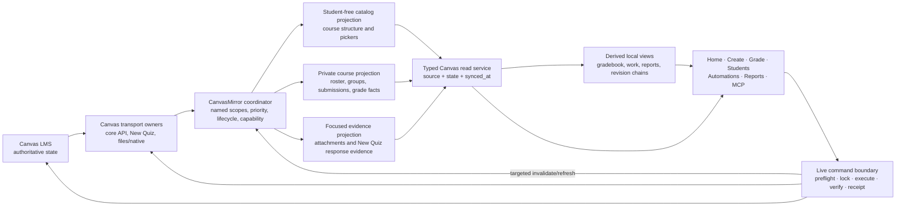

# CanvasMirror to 1.0 beta: the project information spine

Status: **grand vision and migration authority; not an execution brief**

Target: **Canvas Expert 1.0 beta**

As of: **2026-07-17**

Audience: the senior developer who will turn this program into bounded implementation
briefs for one executor at a time

This document defines the destination, invariants, migration order, and release gates for
making CanvasMirror the essential information spine of Canvas Expert. It is intentionally
larger than an ordinary handoff. A senior developer should use it to make current, exact
slice specifications; it must not be handed directly to a weaker implementation agent as
permission to redesign the repository.

`AGENTS.md` remains authoritative for safety, execution, testing, and branch policy.
`docs/mirror.md` describes the mirror that exists today. This document describes the target
state. When the target becomes current behavior, the implementation batch must update the
current contract and module maps in the same change.

## Reading map

- Sections 1–5 lock the product decision, evidence, existing foundation, and design laws.
- Sections 6–10 define the target architecture, projection/read contracts, coordinator,
  and deletion/change semantics.
- Sections 11–15 map every product surface and Canvas endpoint family, then lock Gradebook,
  write-safety, and privacy boundaries.
- Sections 16–18 define performance targets, the ordered migration program, and how a
  senior should write bounded executor briefs.
- Sections 19–24 provide the test matrix, release checklist, known starting issues,
  non-goals, current insertion points, and final north star.

---

## 1. Executive decision

By 1.0 beta, CanvasMirror is the default read plane for Canvas Expert.

That does **not** mean putting a transparent cache in front of every HTTP request, copying
all of Canvas to disk, or allowing cached facts to authorize a write. It means:

- routine course information is acquired once, normalized into narrow local projections,
  and reused by every teacher-facing consumer;
- every read declares its freshness need instead of silently choosing between disk and
  Canvas;
- course lifecycle and per-scope capability are understood, so a concluded or restricted
  course cannot waste minutes repeating known-failing requests;
- teacher focus causes a named, bounded refresh, never an accidental whole-course sync;
- Canvas mutations retain live preflight, idempotency, verification, and receipts;
- every successful mutation invalidates or refreshes only the local scopes it changed;
- pages, files, discussions, and other Canvas objects are mirrored only when a real
  consumer justifies their privacy and performance cost.

“CanvasMirror” therefore becomes the logical subsystem that coordinates a family of
projections. The existing student-free Course Catalog, private roster/submission mirror,
and focused evidence store remain distinct storage and privacy domains. They sit behind one
coordinator and one typed read boundary. They do not need to be collapsed into one physical
directory or one giant schema.

Canvas remains the system of record. CanvasMirror becomes the system through which Canvas
Expert understands that record.

---

## 2. What 1.0 beta must feel like

For the teacher, the transition is successful when:

1. Canvas Expert opens immediately from last-good local state. Background synchronization
   is visible but is not a launch barrier.
2. Moving among Home, Create, Grade, Students, Automations, and reports does not repeatedly
   download the same assignments, roster, or submissions.
3. A normal no-change refresh is short and quiet. A concluded course with unavailable New
   Quiz endpoints does not tax every heartbeat.
4. Selecting one assignment refreshes that assignment's grading context. It does not
   trigger unrelated New Quiz metadata, every attachment, or every course.
5. New, changed, and deleted Canvas objects are reflected predictably. A page remains absent
   only because page content is explicitly outside the mirrored contract, not because the
   system failed silently.
6. Every surface states whether data is current, stale, incomplete, unavailable, or live.
   The teacher never has to guess whether a gradebook is old.
7. Read-only work remains useful during a Canvas outage. Write controls remain conservative
   and refuse to treat local state as a live preflight.
8. A CanvasExpert write appears in the local read model promptly through targeted
   reconciliation, without waiting for the next global heartbeat.
9. Sync status and performance are understandable without exposing student names, content,
   tokens, signed URLs, or private filesystem paths.

For the codebase, the transition is successful when:

- UI routes and feature modules do not construct routine Canvas GET paths;
- one acquisition owner exists for each mirrored scope;
- consumers request typed facts, not endpoint-shaped dictionaries;
- live transport remains explicit for diagnostics, focused evidence, preflight, writes,
  and post-write verification;
- direct `requests` usage is confined to named specialized transports;
- a repository-level boundary check prevents new bypasses;
- the old mirror shims can be retired after consumers converge on the shared read service.

---

## 3. Why this is now a release-level concern

CanvasMirror already proves the value of local reads. The remaining problem is structural:
the application still has multiple acquisition owners, multiple freshness stories, and
several endpoint call sites that bypass the mirror entirely.

### 3.1 Measured baseline

A July 2026 test used three configured courses: one current course and two concluded
courses. The data below is aggregate and contains no course or student identity.

| Scenario | Wall time | Physical HTTP GETs | Bytes downloaded |
|---|---:|---:|---:|
| Empty private mirror to all three courses | 12:01.7 | 383 | 23.11 MiB |
| Immediate refresh after a small set of changes | 2:17.4 | 113 | 2.91 MiB |

The warm refresh spent almost all of its time in network calls:

- 11 successful logical calls consumed 33.0 seconds;
- 96 forbidden New Quiz metadata calls consumed 81.4 seconds;
- one connection failure consumed 22.2 seconds;
- there was no deliberate sleep, cooldown, or structural time gate causing the delay.

On the cold sync, successful logical calls consumed about 574 seconds and forbidden New
Quiz calls consumed about 136 seconds. The 403s are not the only cold-sync cost, but they
are the dominant avoidable warm-sync cost.

The change test also exposed correctness boundaries. The teacher created an assignment/New
Quiz, deleted an assignment, and created a page. The comparison surfaced only the
assignment creation. The page omission is expected under the current contract because page
content is not mirrored. The missing deletion signal is not acceptable for an information
spine and must be resolved before 1.0 beta.

### 3.2 The architectural diagnosis

The benchmark is not evidence that “Canvas is just slow.” It exposes four design issues:

1. **Lifecycle ignorance.** A course can be configured in Canvas Expert while concluded in
   Canvas. Configuration membership and Canvas lifecycle are currently conflated.
2. **Capability ignorance.** A scope that returns a durable 401/403 is retried per object and
   per heartbeat instead of being recorded as restricted with a bounded reprobe policy.
   For New Quizzes the root cause is already known and documented (`api/README.md`): the
   gate is **active enrollment** — the same token and endpoint return 200 in an
   actively-enrolled course and 403 once the enrollment is concluded/retired. The failure
   is course-level and predictable from lifecycle, not a per-quiz mystery.
3. **Oversized refresh semantics.** `sync_now(course_id)` means “run the whole delta,” even
   when PowerGrader only needs submissions for one assignment.
4. **Incomplete deletion semantics.** The current assignment index can change while orphan
   submission files remain readable until a full reconcile; change reporting also failed
   to prove the tested assignment deletion.

These are information-spine concerns, not isolated New Quiz bugs.

---

## 4. Existing foundation: preserve it, do not rebuild it

The 1.0-beta program begins from substantial completed work.

### CanvasMirror v1

- Versioned private course storage under the configured workspace.
- Students, sections, assignments, current submissions, attempt history, grades, status,
  and nightly submission comments.
- Full, delta, and roster passes with last-good behavior and watermarks.
- Mirror-first gradebook snapshots and MCP roster/submission reads.

### CanvasMirror New Quizzes v2

- Continuous New Quiz metadata and item catalogs.
- Focused, on-demand response snapshots.
- Append-preserving attempts and URL/credential scrubbing.
- PowerGrader cache reads while native evidence and every grading write remain live.

### CanvasMirror v3 read migration

- Work-discovery providers are mirror-first for assignments, users, and submissions.
- Display-only routine reads and curve assignment lists are mirror-first.
- Text-only PowerGrader session creation uses delta-then-disk.
- Submission comments are persisted on full passes.
- The pseudonym vault has separate multi-machine hardening.

### Course Catalog v1

- A student-data-free assignment/module projection with strict allowlists.
- Rich assignment descriptions, rubric data, and module-item outlines.
- Atomic writes, previous snapshots, corruption recovery, and OneDrive conflict warnings.
- PowerGrader setup reads the catalog before a bounded selected-course refresh.

### Existing write safety

- Operation-ledger adapters own most content and gradebook mutation workflows.
- PowerGrader has explicit review, live preflight, idempotency, and receipt rules.
- New Quiz item-finalization route/transport machinery exists around specialized short-lived
  native transport and verification. The lane was deliberately shipped (commit `4a4309a`,
  2026-07-14) with preflight, idempotency, receipts, and tests; the durable New Quiz
  capability docs still describe it as blocked. Program 0's first outcome updates those
  docs to match the shipped code before any later brief touches this boundary.

The migration must converge these pieces. It must not replace them with a database, a new
job platform, a raw-response cache, or a second write system.

---

## 5. Non-negotiable design laws

These are the architectural decisions future briefs must inherit.

### 5.1 Canvas is truth; projections are disposable

Every mirrored Canvas fact can be deleted and rebuilt. A projection may preserve attempt
history observed over time, but it never becomes a competing authority. Corrupt projection
files are treated as absent or recovered from a validated previous snapshot.

### 5.2 CanvasMirror is not a universal HTTP proxy

Do not intercept arbitrary GET strings and call that architecture. Endpoint-matching shims
were useful migration seams; they are not the final API. Consumers ask for typed scopes or
views. Acquisition owners know the Canvas endpoints.

### 5.3 One acquisition may feed multiple projections

Assignments are currently fetched for both the private mirror and Course Catalog. In the
target state, one in-memory acquisition can emit:

- a slim private/read-compatible assignment index;
- a rich, student-free catalog assignment record;
- invalidation signals for derived work and grading views.

Raw Canvas responses are not written to disk. Each projection validates and commits its own
allowlisted shape independently.

### 5.4 Privacy boundaries stay physical and explicit

Student-free navigation data, private student state, focused binary evidence, identity
vaults, and operation receipts are not merged for convenience. A consumer receives only
the projection it needs.

### 5.5 Freshness is per course and per scope

There is no honest global “synced” boolean. Roster can be current while New Quiz responses
are unavailable; assignments can be current while comments are stale. Every read result
carries state, source, and time.

### 5.6 Read intent is explicit

A display read, focused grading refresh, and write preflight are different operations. The
caller declares which one it needs. A generic fallback helper must not silently upgrade a
local display read into a multi-minute global fetch.

### 5.7 Reads that can cause a write remain live at the decision boundary

Local data may populate pickers, dashboards, and provisional previews. Before any Canvas
mutation, the owning adapter obtains authoritative live state under its existing lock,
drift, idempotency, and receipt rules. The mirror never authorizes a grade, comment,
extension, group change, late-policy change, or content mutation.

### 5.8 Foreground teacher work outranks background freshness

Create must not wait for unrelated submission synchronization. A focused assignment refresh
must outrank a concluded-course maintenance pass. Background work yields or pauses while a
write preflight is active.

### 5.9 Deletion is a first-class change

A complete authoritative collection response defines membership. Removed assignments,
students, groups, comments, and New Quiz records must stop appearing in queries immediately
after that complete response commits. Cleanup may follow, but stale orphan files cannot
remain logically visible.

### 5.10 Failure retains last-good data but never claims success

Transport failure, authorization failure, invalid records, partial pagination, and storage
failure produce different sanitized states. None erases last-good data. None advances a
watermark. None is mislabeled current.

### 5.11 Background synchronization is read-only

Normal GETs and the narrowly classified New Quiz report-generation read path are permitted.
No heartbeat may issue a grade, comment, content, membership, policy, or file mutation.

### 5.12 Performance is part of correctness

A scope that retries 96 known-forbidden calls every 15 minutes is malfunctioning even if it
eventually returns the right accessible data. Request count, bytes, wall time, failure class,
and queue delay are acceptance evidence.

---

## 6. Target architecture



The arrows are intentionally asymmetric:

- the mirror receives facts from Canvas;
- UI and reports receive facts from typed local reads;
- commands bypass the mirror for authority;
- successful commands teach the mirror what to refresh;
- derived views never write Canvas directly.

### 6.1 Logical components

**Canvas transport owners** perform HTTP, pagination, rate-limit handling, credential
scrubbing, and sanitized timing. The normal core client remains separate from specialized
New Quiz native/report and file-transfer transports.

**CanvasMirror coordinator** accepts named scope requests, understands dependencies,
coalesces duplicates, prioritizes teacher focus, and applies course lifecycle/capability
policy.

**Projection writers** normalize an acquisition into one strict storage contract. They do
not call Canvas and do not know UI routes.

**Typed read service** is the only routine information boundary for consumers. It returns
data plus provenance and freshness. It may request a bounded refresh according to explicit
policy.

**Derived views** compute reusable teacher concepts—gradebook snapshots, attention rows,
grading debt, revision chains, report facts—from projections. They do not become a second
Canvas cache.

**Live command boundary** owns every mutation and its authoritative reads. The operation
ledger and PowerGrader remain the principal implementations.

---

## 7. Projection model and 1.0-beta scope boundary

The following table is the target scope decision. “Required” means a concrete current
consumer justifies the scope before 1.0 beta. “Focused” means acquire only in response to a
teacher-selected object or write workflow. “Deferred” means do not add merely for symmetry.

| Canvas information | 1.0-beta treatment | Projection / owner | Primary consumers | Important boundary |
|---|---|---|---|---|
| Configured course identity, name, Canvas lifecycle, enrollment access | Required | Student-free course context | All course pickers, scheduler, status | Configured does not mean current |
| Per-course/per-scope capability | Required | Student-free capability envelope | Coordinator, diagnostics | Record restricted/unsupported and cooldown |
| Assignments and quiz classification | Required; shared acquisition | Catalog + private slim projection | Home, Create, Gradebook, PowerGrader, reports, MCP | One fetch, separate allowlists |
| Modules and module-item outlines | Required | Student-free catalog | Create, Course Info, PowerGrader | No page bodies implied |
| Assignment-group definitions and weights | Required | Student-free gradebook/structure scope | Create pickers, Gradebook, reports | Execution resolves live before writes |
| Rubric index/definitions used by pickers and display | Required when current picker/display consumes it | Student-free structure scope | Create, PowerGrader setup | Embedded assignment rubrics may remain catalog records |
| Canvas late policy and relevant gradebook course settings | Required | Student-free gradebook-config scope | Gradebook display and operation preparation | Apply/verify remains live |
| Canvas grading periods | Conditional required | Student-free gradebook-config scope | Gradebook only when course uses them | Distinct from local academic calendars |
| Students and sections | Required; already present | Private roster projection | Students, Gradebook, reports, Work, MCP | No email/avatar by default |
| Group categories, groups, memberships | Required | Private group projection | Roster, Course Info, Work warnings, differentiated Create pickers | Mutations and final verification live |
| Current submission row, score, grade, workflow/status | Required; already present | Private per-assignment submissions | Gradebook, Work, reports, PowerGrader text path, MCP | IDs remain normalized consistently |
| Attempt history and text-entry bodies | Required; already present | Private per-assignment submissions | PowerGrader, revision views | Preserve observed attempts; no invented backfill |
| Personalized due facts (`cached_due_date`, late seconds/override where returned) | Required | Private submission projection | Student Reports, late-work display, Gradebook | Do not replace focused override preflight |
| Submission comments and staff-role facts | Required | Private submission projection / comment reconcile | Home attention, grading debt, reports | Comment-only changes need an explicit freshness policy |
| New Quiz metadata and item catalog | Required for accessible scopes; already present | Private New Quiz metadata projection | PowerGrader | Restricted courses must not fan out failures |
| New Quiz student responses | Focused; already present | Private per-assignment/student response snapshots | PowerGrader | Never a write preflight |
| Attachment names and evidence completeness | Required as metadata | Private submission/evidence records | PowerGrader, reports | Signed URLs never persist |
| Attachment/file bytes | Focused only | Canonical private evidence owner | PowerGrader, explicit open/download, portfolios | Never background-prefetch all files |
| Assignment overrides | Focused/live | Command or focused report owner | Extensions, differentiation, write preflight | Do not globally mirror override trees for 1.0 beta |
| Page/module item stubs | Required through modules | Student-free catalog | Course structure/navigation | Title/type/content ID only |
| Page bodies | Deferred | No 1.0-beta projection | Possible future course search/AI context | Add only with a named consumer and plain-text allowlist |
| Classic Quiz questions and detailed responses | Live/focused or Canvas-native | PowerGrader/SpeedGrader boundary | Grading | No broad mirror in 1.0 beta |
| Teacher/TA/observer directory | Deferred/minimal classification only | None unless a current consumer proves need | Comment authorship edge cases | Do not mirror emails for convenience |
| Student email and avatars | Live explicit action or remove consumer | No default persistence | Course Info edge case | Privacy cost exceeds routine value |
| Discussions and announcements | Deferred | None | No current essential consumer | Not mirrored for completeness |
| Calendar events | Deferred | None | No current essential consumer | Local academic calendar remains separate |
| Course navigation and general course settings | Deferred except named gradebook fields | None / gradebook-config allowlist | Specific future consumer only | Avoid raw course-object storage |
| Grade-change audit history | Live/receipt-based | Operation receipts, not mirror | Reconciliation/support | Current state is not an audit log |
| Operation plans, receipts, pseudonym vault | Outside CanvasMirror | Existing private owners | Writes, AI safety | Irreplaceable local state is not disposable mirror data |

### 7.1 Why page bodies are not a 1.0-beta requirement

The project can create, reconcile, and place pages without using page bodies as routine read
context. Those operations require live baselines and verification anyway. Module item stubs
already answer the current navigation question: what page is placed where?

A page-body scope becomes worthwhile if a concrete product needs local course search,
course-context generation, content audits, or offline page review. That future scope should
be student-free, persist normalized plain text plus stable identity/timestamps, and never
store raw HTML, signed URLs, or arbitrary page fields. It should not be added during the
1.0-beta migration merely because pages exist in Canvas.

### 7.2 Course Catalog remains separate on disk

The student-free Course Catalog is a successful privacy boundary. The target is shared
acquisition and a shared read/coordinator API, not forced storage consolidation. Existing
paths should remain compatible unless a later contract migration has an immediate payoff.

### 7.3 Focused evidence remains a separate owner

Binary attachments and New Quiz native evidence have different size, authorization,
freshness, and renderer constraints from metadata. CanvasMirror coordinates their status
and exposes their completeness; it does not turn the heartbeat into a course-wide download
job.

### 7.4 Schema evolution is rebuild-first and last-good-safe

Private mirror projections are disposable, but a version transition must not force the
teacher to stare at an empty product during a long rebuild. When a scope needs a new schema:

1. leave the validated old projection readable under its old contract;
2. mark the new scope unavailable/rebuilding rather than pretending the old shape contains
   new fields;
3. acquire and validate the new version beside the old one;
4. atomically make the new version canonical only after complete success;
5. retain or remove old disposable versions according to a documented compatibility window;
6. never migrate private projection data by sending it outside the workspace.

Additive fields may use a bounded compatibility reader when validation permits, but “just
patch every old JSON file in place” is not the default.

### 7.5 Shared acquisition does not claim a Canvas transaction

One assignments fetch may emit multiple projections with a common acquisition generation
and observation time. Each projection still validates and commits independently. If the
catalog commit succeeds and the private projection commit fails, the two scopes report
their real independent state; the system does not claim an impossible cross-file or Canvas
transaction. A later retry reuses or reacquires according to the versioned contract.

---

## 8. The typed read contract

The final API should be based on scope and intent, not Canvas URL shape. Exact Python names
belong in a senior-written contract, but every implementation must preserve these semantics.

### 8.1 Read intents

| Intent | Typical use | Allowed source behavior | Must never happen |
|---|---|---|---|
| Local display | Home cards, pickers, roster table, grade snapshot | Return current or allowed-stale local data immediately; optionally queue background refresh | Block the route on a whole-course sync |
| Refresh if stale | Opening a selected course surface | Return last-good data and request the named stale scope | Refresh unrelated scopes/courses |
| Focused current | Start grading one assignment, refresh one report | Synchronously acquire the minimum named scope, then read projection | Treat an old general freshness timestamp as sufficient |
| Authoritative live | Write preview that must exactly match execution, preflight, verify | Call Canvas through the command owner | Substitute mirror data when Canvas is unavailable |
| Explicit diagnostic | Test connection, refresh course list, investigate capability | Live call with sanitized output | Persist raw errors/tokens or silently alter normal capability policy |
| Offline | Canvas unavailable | Serve last-good local state with stale/offline label | Enable a write or claim current |

### 8.2 Every result has an envelope

The exact schema should be versioned in a durable contract. Conceptually every scope/view
result includes:

```json
{
  "course_id": "synthetic-id",
  "scope": "submissions",
  "state": "current",
  "capability": "supported",
  "source": "mirror",
  "last_success_at": "ISO-8601",
  "last_attempt_at": "ISO-8601",
  "canvas_observed_at": "ISO-8601 or empty",
  "retry_after": "ISO-8601 or empty",
  "generation": "opaque local generation",
  "error_code": "sanitized stable code or empty",
  "records": []
}
```

This is illustrative, not a command to widen every current file. The durable contract must
define which fields persist and which are computed at read time. Two decisions are locked
now to prevent drift: the payload key is `records`, matching the existing Course Catalog
contract (do not introduce a parallel `data` key); and adding envelope fields to the Course
Catalog requires a versioned schema bump with a validator update, because the catalog
contract rejects unknown keys — a brief must never loosen unknown-field rejection to
smuggle envelope fields in.

### 8.3 State and capability are separate

Persisted data state should converge on:

- `current`: the requested acquisition completed and validated;
- `stale`: last-good data exists but the newest attempt failed or exceeded its age policy;
- `incomplete`: useful data exists, but pagination, record validation, evidence, or joins
  did not fully complete;
- `unavailable`: no usable data exists.

Runtime `queued` and `refreshing` states may be presented by the coordinator but should not
replace the last-good persisted state.

This four-state enum is not new everywhere: the Course Catalog contract already uses
exactly these four states, while the private mirror currently persists only a two-state
degradation (`stale` after a prior success, `unavailable` before one) and has no
`incomplete`. The migration is therefore "the private mirror adopts the catalog's existing
enum," not a fresh invention — briefs must say so, or an executor reading only
`docs/mirror.md` will believe `incomplete` is novel.

Capability should separately express:

- `supported`: the scope has succeeded or the course advertises it;
- `restricted`: authorization/lifecycle prevents access with current credentials;
- `unsupported`: the Canvas/course feature does not exist;
- `unknown`: not yet probed or a transient failure prevents classification.

A restricted scope can still have stale last-good data. An unavailable scope is not
necessarily unsupported.

### 8.4 Source labeling is end-to-end

Any UI, MCP payload, report manifest, or support snapshot that exposes freshness must use
the common envelope. Do not invent surface-specific `cached`, `fresh`, `loaded`, and
`synced` booleans with different meanings.

---

## 9. Coordinator and scheduling model

### 9.1 Named scopes replace monolithic `sync_now(course_id)`

The coordinator must support the minimum useful scope. Likely scope families are:

- `course_context`;
- `course_structure.assignments`;
- `course_structure.modules`;
- `course_structure.assignment_groups`;
- `course_structure.rubrics` where consumed;
- `gradebook_config`;
- `roster`;
- `groups`;
- `submissions.course_delta`;
- `submissions.assignment_current`;
- `comments.reconcile`;
- `new_quizzes.metadata`;
- `new_quizzes.response:<assignment>`;
- `evidence:<assignment>`.

The senior may choose different names, but a focused submissions refresh must not imply New
Quiz metadata, roster, modules, or every course.

“Full sync” becomes an orchestration plan over scopes, not one inseparable function. This
allows independent failure, retry, progress, and lifecycle policies.

Vocabulary warning for brief authors: today's contract (`docs/mirror.md`) is written in
terms of **passes** (`full`, `delta`, `roster`), while this document is written in terms of
**scopes**. The words overlap — there is a roster *pass* today and a `roster` *scope*
tomorrow, and today's delta pass covers what becomes `submissions.course_delta` plus
`new_quizzes.metadata`. Every brief must state which vocabulary it uses and map between
them explicitly; an executor must never treat "pass" and "scope" as synonyms.

### 9.2 Priority order

The coordinator should enforce this order:

1. live command preflight and verification;
2. targeted post-write reconciliation;
3. teacher-focused refresh for the selected course/assignment;
4. explicit manual refresh;
5. current-course background maintenance;
6. concluded-course maintenance and low-priority true-ups.

Background requests must yield before they starve a write preflight. Duplicate requests for
the same course/scope should coalesce. A fixed, small concurrency bound is appropriate;
Canvas Expert does not need a generalized adaptive job platform.

### 9.3 Course lifecycle policy

Canvas Expert configuration and Canvas lifecycle are separate dimensions:

- **configured current course:** normal background deltas plus daily reconcile;
- **configured concluded/read-only course:** initial/explicit sync and low-frequency
  maintenance for accessible scopes, but no 15-minute submission/New Quiz churn;
- **configured inaccessible course:** retain last-good data, expose restriction, and retry
  only on manual request or bounded capability cooldown;
- **unconfigured course:** may remain on disk, but normal routes and heartbeat do not read or
  refresh it.

A concluded course may still expose core assignments/submissions while restricting New Quiz
metadata. Capability must remain per scope; lifecycle is not a blanket assumption.

Recommended policy for 1.0 beta:

- current courses: 15-minute lean deltas, daily roster and full correctness reconcile;
- concluded courses: no normal 15-minute delta; refresh last-good accessible scopes when
  explicitly focused or older than a daily maintenance threshold;
- restricted scopes: no heartbeat reprobe before `retry_after`; manual diagnostic refresh
  can override the cooldown;
- lifecycle/capability context: refresh on course-list refresh, manual sync, or a modest
  daily cadence.

Exact intervals are tuneable parameters, not reasons to change the architecture.

### 9.4 Capability circuit and error policy

The current New Quiz behavior performs a per-quiz call even after repeated 403s prove the
scope is unavailable. The root cause of those 403s is documented in `api/README.md` and
confirmed in production use: New Quiz endpoints are gated on **active enrollment**, so a
current course succeeds while a retired/expired/closed course fails deterministically. The
design is therefore **lifecycle predicts, probe confirms, circuit backstops**: the
course-context lifecycle signal downgrades the New Quiz scope before any fan-out, one
bounded probe per cooldown confirms the classification, and the generic circuit below is
the backstop for failures lifecycle cannot predict. The target behavior is:

1. classify failures into stable sanitized categories (`unauthorized`, `forbidden`,
   `not_found`, `rate_limited`, `timeout`, `connection`, `invalid_response`, `storage`);
2. distinguish transient transport failures from durable course/scope restrictions;
3. open a course/scope circuit after bounded evidence of a capability-class authorization
   failure;
4. skip remaining fan-out work for that scope;
5. retain last-good data and record `retry_after`;
6. probe again only on cooldown, lifecycle change, explicit manual request, or a relevant
   successful CanvasExpert mutation.

One bad item must not poison a whole supported scope. The acquisition contract must state
when a failure is scope-level and when it is record-level. For the New Quiz metadata scope,
the enrollment gate makes the classification course-level: consecutive 403s across distinct
quizzes in one course are scope evidence, not item noise. Program 0 must also test whether
the New Quiz collection endpoint (`GET /api/quiz/v1/courses/:id/quizzes`) can serve as a
one-call scope probe — and potentially replace the per-quiz metadata fan-out outright for
accessible courses.

### 9.5 Pagination, rate limits, and timeouts

- Physical page requests and logical collection requests must be measured separately.
- Pagination completion must be proven before a collection can authorize deletion.
- Canvas rate-limit headers and 429 retry timing must be honored.
- Retries must be bounded and visible; no hidden multi-minute loop.
- Long submission collections may run concurrently with independent course metadata within
  the fixed coordinator bound, but not with unbounded per-assignment fan-out.
- Network acquisition, normalization, validation, and disk commit times must be measured
  separately so slow Canvas responses are not confused with local processing.

### 9.6 Startup and manual sync behavior

The application shell and last-good data render before synchronization. The existing
two-minute catch-up can evolve, but there must be no global readiness barrier.

Manual sync should report course/scope progress and allow a selected course or named scope.
A manual “all configured courses” action may enqueue a plan; it must not hold one HTTP
request open for twelve minutes or make the UI unusable.

---

## 10. Correct change and deletion semantics

### 10.1 A complete collection defines membership

For assignments, students, modules, groups, and similar collections, the acquisition layer
must preserve evidence that all pages completed and all accepted records validated. Only
then may the new ID set replace the old set.

A fully successful, fully paginated empty response can be authoritative. A timeout, partial
pagination, invalid root, or rejected record cannot.

Current behavior splits in two directions, and briefs must target the right owner:

- The **Course Catalog** (`api/course_catalog.py`) treats a successful empty response as a
  failure and retains last-good records, so it cannot represent the legitimate deletion of
  the last object. Fixing it may require a new catalog contract version.
- The **private mirror** (`api/mirror/sync.py` + `store.py`) has the inverse hazard: it
  writes any non-error empty collection as authoritative membership, and the full pass then
  prunes submission files from it. A truncated or transiently empty response is therefore
  potentially destructive. The mirror must prove pagination completeness before an empty
  (or shrunken) collection may drive deletion or pruning.

### 10.2 Assignment deletion behavior

After a complete assignment collection commits:

1. compute added, changed, unchanged, and removed assignment IDs;
2. publish the new assignment index atomically;
3. make aggregate submission queries filter by the committed assignment membership
   immediately;
4. invalidate related New Quiz metadata, report snapshots, derived views, and catalog/module
   references for removed assignments;
5. prune orphan disposable mirror files only after path validation and successful commit;
6. record sanitized change counts for diagnostics.

Filtering provides immediate logical correctness. Pruning controls disk/OneDrive clutter.
Neither action may touch canonical teacher evidence or operation receipts.

### 10.3 Submission and attempt behavior

- Delta merges remain idempotent with overlap.
- Attempts observed for a living submission remain append-preserving.
- A complete full reconcile may remove submissions/students no longer present in Canvas.
- An assignment deletion removes the assignment from all aggregate reads even before file
  cleanup.
- Current pointers reflect the newest authoritative fetch, not merely the highest locally
  preserved attempt.

### 10.4 Comment freshness and deletion

Comments are a known delta blind spot because comment-only activity does not reliably move
the existing submission watermarks. The 1.0-beta contract should use three lanes:

- lean 15-minute submission deltas without expensive comment-wide refresh;
- targeted post-write refresh after CanvasExpert posts a comment;
- bounded comment reconcile for a focused Home/Grade surface plus a daily full correctness
  pass.

The UI must show comment freshness separately. A complete comment-bearing reconcile must be
able to replace an old non-empty list with an authoritative empty list so deleted comments
do not persist forever. A lean delta that omitted comments must preserve the existing list.

### 10.5 Page changes

Page-body creation, update, or deletion does not count as a mirror miss while page bodies
remain outside the contract. Module placement changes do count because module outlines are
mirrored. Diagnostics and tests must state the scope expectation before judging a change.

### 10.6 New Quiz changes

- Assignment identity is the bridge between core Canvas and New Quiz metadata.
- A complete assignment removal invalidates the corresponding New Quiz tree.
- Metadata true-up remains bounded because item changes may not bump assignment timestamps.
- Known-restricted courses do not perform per-quiz fan-out.
- Focused response snapshots retain attempts but do not claim freshness for students or
  attempts that could not be joined.

---

## 11. Tool-to-Canvas routing in the target state

This section is the product map the senior should preserve while writing implementation
briefs.

### 11.1 Home and Work

**Local spine:** course context, assignments, submissions, comments, roster, groups, and
derived attention/work rows.

**Canvas on focus:** a bounded comment reconcile when Home needs fresher conversation
state; an explicit retry for a failed scope.

**Canvas writes:** none from discovery. Any action launched from a work row enters its
owning operation or PowerGrader command path.

**Transition:** remove endpoint-regex provider shims after providers use the typed read
service. Work Registry remains job authority, not a second student-data store.

### 11.2 Create / Course Expert

**Local spine:** configured course context, modules, module items, assignment groups,
assignment/rubric search records, and course capability.

**Canvas live:** operation-ledger baseline, name collision/drift checks when required,
assignment/page/quiz/rubric creation or update, file upload, module placement, overrides,
and verification.

**After write:** refresh or invalidate exact structure scopes. Assignment creation updates
both catalog and private assignment projections; module placement refreshes modules; rubric
creation refreshes rubric index; a page operation refreshes module stubs and a future page
index only if one exists.

**Important:** local pickers reduce latency. They never prove that a target still exists at
execution time.

### 11.3 Course Info

**Local spine:** course context, students, sections, groups/memberships, modules, and
assignments.

**Canvas live:** explicit course-list refresh; any user-requested field intentionally not
persisted, such as email, if that feature remains.

**Transition:** replace the current N+1 group/member route and duplicate assignment/module
fetches. Decide whether email provides enough teacher value to justify an explicit live
action; do not add email to the mirror merely to preserve the current response shape.

### 11.4 Grade / PowerGrader

**Local spine:** course/assignment picker data, rubric context, text-entry submission rows,
attempt history, comment context, and fresh cached New Quiz metadata/response snapshots.

**Focused Canvas reads:** exact assignment current state; exact assignment submissions when
the named delta cannot satisfy them; attachment and media evidence; Student Analysis report
generation; native New Quiz evidence; late-catch-up polling.

**Canvas writes:** grade/comment pushes and New Quiz item finalization under existing review,
lock, idempotency, and verification rules.

**After write:** refresh exact submission/student or New Quiz response scope, then invalidate
grading-debt/attention views. Do not call whole-course `sync_now` from a text submission
refresh. Do not run unrelated New Quiz metadata as a side effect.

### 11.5 Gradebook Expert

**Local spine:** students, assignments, submissions, personalized due facts, assignment
groups/weights, Canvas late-policy display, relevant grading settings, optional Canvas
grading periods, and derived grade snapshots.

**Canvas live:** curve baselines that feed a write, sweep final recomputation, extensions and
assignment overrides, late-policy apply/verify, and every grade/status mutation.

**After write:** refresh only affected gradebook config, assignment, submission, or due-fact
scopes.

**Release blocker:** the direct `/api/sweep/apply` path currently accepts client-submitted
preview entries without a fresh authoritative re-read. Before local preview data expands,
this path must recompute live at apply time or route through the operation-ledger sweep
adapter.

### 11.6 Students / Roster

**Local spine:** students, sections, group categories, groups, memberships, local aliases,
tiers, and extra-time settings.

**Canvas live:** group creation, membership add/remove, and final membership verification.

**After write:** targeted group/membership refresh and invalidation of roster-warning views.

**Transition:** the roster page should not refetch users/sections/groups merely because the
teacher revisits it.

### 11.7 Student Reports and portfolios

**Local spine:** roster identity, assignments, submission standing, text bodies, attempts,
comments, group names, personalized due facts, and derived report facts.

**Focused Canvas/evidence:** attachment bytes, signed download URLs in memory, and any report
field absent from a deliberate projection.

**Transition:** split current direct `requests.Session` collection code into local metadata
assembly plus focused evidence acquisition. Reports should state source/freshness in their
private manifest. Do not copy signed URLs into reports.

### 11.8 Automations / Routines

**Local spine:** every detection, count, and report-only routine whose required scope is
fresh enough.

**Canvas live:** the final compute/preflight and execute phases of any routine that mutates
Canvas.

**Transition:** built-in and custom routines receive a supported mirror-read interface and
an explicit live command interface. A custom routine must not construct arbitrary Canvas
GETs for data already owned by the spine.

### 11.9 MCP

**Local spine:** roster, assignments, submissions, grades/status, and allowed derived views,
with existing local pseudonymization and source labeling.

**Canvas live:** only a bounded, explicitly authorized fallback when no usable projection
exists. An MCP read must not unexpectedly initiate an all-course first sync.

**Safety:** newly mirrored private fields do not automatically enter MCP payloads. Each
field needs an outbound allowlist and scrub review.

### 11.10 Settings and Connections

**Local spine:** configured course context, last-known lifecycle/capability, sync state, and
sanitized performance diagnostics.

**Canvas live:** connection test, `/users/self`, explicit course discovery, and deliberate
capability diagnostic.

**Transition:** course discovery teaches the local course-context scope. Status pages read
local envelopes; they do not probe Canvas simply to render.

### 11.11 Operation Ledger

**Local spine:** course/module/assignment-group/rubric pickers may use local projections.

**Canvas live:** prepare baselines where correctness demands it, execute, drift detection,
reconcile, and verify. These remain live even when equivalent facts exist locally.

**After write:** every adapter declares the scopes it invalidates or refreshes. The ledger
must not implement its own shadow cache.

### 11.12 AI Expert

AI Expert has no Canvas read requirement. It remains local. Do not route it through
CanvasMirror for architectural symmetry.

### 11.13 Diagnostics and support

Operational status uses sanitized local metrics: course alias or configured label where
appropriate, scope, state, request counts, durations, bytes, retry/circuit state, and stable
error code. Live health tests remain explicit user actions. Support bundles exclude student
rows, response bodies, tokens, URLs containing signed values, and private paths.

---

## 12. Canvas endpoint-family ownership

The senior should re-run the repository call-site inventory before each migration batch.
This table states the end-state owner, not permission to change every caller at once.

| Endpoint family | Routine read owner | Live/focused owner | 1.0-beta rule |
|---|---|---|---|
| `/users/self`, available courses | None | Settings/Connections transport | Always explicit live diagnostics/discovery |
| Course identity/state | Course-context scope | Settings refresh | Persist lifecycle/capability context |
| Assignments collection | Shared structure acquisition | Operation adapters for preflight | Emit catalog + private projections once |
| Assignment detail | Local assignment view when display-only | PowerGrader/operation focused preflight | Intent decides source |
| Modules/items | Catalog structure acquisition | Operation adapters for placement/reconcile | Pickers local, writes live |
| Assignment groups | Structure/gradebook-config scope | Operation resolution/preflight | Picker/report local, execution live |
| Rubrics | Student-free rubric/assignment catalog | Rubric operation adapter | Add only fields consumed by current UI |
| Users/students/sections | Private roster scope | Focused explicit field request | Routine roster local |
| Group categories/groups/memberships | Private groups scope | Roster and operation adapters | Remove N+1 display reads |
| Course submissions | Private submission delta/reconcile | Focused assignment and write preflight | No duplicate surface fetches |
| Assignment submissions | Named focused scope | PowerGrader/grade command | Never imply whole-course sync |
| Late policy/course grading config | Gradebook-config scope | Late-policy adapter | Display local, mutation live |
| Assignment overrides | None globally | Extension/differentiation focused owner | Remain live/focused for beta |
| Core quizzes / Classic Quiz details | None broadly | Focused grading/content owner | Do not mirror for completeness |
| New Quiz metadata/items | New Quiz metadata scope | Quiz operation preflight | Capability circuit required |
| New Quiz reports/responses | Focused response scope | PowerGrader report owner | Report generation never global heartbeat work |
| Native New Quiz launch/result/item calls | None | Specialized PowerGrader grader/evidence owner | Credentials and signed URLs memory-only |
| Files/attachments | Metadata in projections | Focused evidence/upload owner | No background binary sweep |
| Pages | Module stubs only | Page operation adapter | Page bodies deferred |
| Discussions/announcements/events | None | Future named consumer only | Out of 1.0-beta scope |

Direct `requests.Session` usage should remain only where the shared core client cannot own
the protocol: signed/native New Quiz transport, streaming/binary evidence, explicit
diagnostics, or similarly documented cases. Student Reports and portfolios are not special
protocols; their routine metadata calls should move behind the read service.

---

## 13. Gradebook as a first-class mirror consumer

Gradebook is where the information-spine idea becomes most valuable and most dangerous.

### 13.1 Separate three kinds of “calendar”

1. **Local academic calendars** are user-provided workspace CSVs used for school-day math
   and locally named grading periods. They are not Canvas data and remain owned by config.
2. **Canvas grading periods** are Canvas course/account facts. Mirror them only for a course
   that uses them and a Gradebook feature that consumes them.
3. **Assignment/student effective due facts** come from assignments, submissions, and
   focused overrides. They are neither of the above.

The current Gradebook “grading periods” UI reads local calendar CSV data. Routing it through
CanvasMirror would be incorrect. Adding Canvas grading-period awareness is a new conditional
feature.

### 13.2 Gradebook configuration scope

The student-free gradebook-config projection should include only fields used by Gradebook:

- late-policy settings;
- assignment-group identity, order, and weights;
- whether weighted groups apply;
- grading-scheme identifiers/settings only where the UI displays or computes with them;
- Canvas grading-period identity/dates only when enabled and consumed;
- a small capability/freshness envelope.

It should not persist raw course settings.

### 13.3 Read-only gradebook views

Grade snapshots, student/assignment pickers, standing, missing/late/excused state, report
inputs, and configuration display come from the local spine. Personalized due fields should
be added to the private submission allowlist because current reports use
`cached_due_date`/`seconds_late` but the mirror currently drops them.

### 13.4 Write-adjacent gradebook workflows

- **Late policy:** show local last-good policy; prepare/apply/verify live through the
  operation owner; refresh gradebook config after success.
- **Sweep:** a display estimate may use current local facts; apply recomputes authoritative
  assignments, submissions, and students under the operation lock before writing
  `seconds_late_override`.
- **Curves:** list assignments locally; preview may be live when it is presented as the
  exact write plan; apply and revert always reload authoritative scores.
- **Extensions:** list students/assignments locally; read and mutate assignment overrides
  live; refresh affected due facts after success.
- **Extra time:** list students locally; local accommodation settings stay local; any Canvas
  differentiation generated from them preflights live.

There must be no route where a browser-submitted local preview is accepted as the
authoritative write set.

---

## 14. Write safety and targeted reconciliation

### 14.1 The command sequence

Every Canvas mutation follows the same conceptual sequence, even if existing owners use
different internal names:

1. identify exact course/object scope;
2. acquire authoritative live state;
3. evaluate capability, drift, policy, and idempotency;
4. freeze the plan under the appropriate lock;
5. record receipt preflight where required;
6. execute the minimum Canvas mutation;
7. re-fetch and verify authoritative result;
8. finalize receipt;
9. request targeted mirror reconciliation;
10. show success only with honest verification/reconciliation status.

If step 9 fails, the Canvas write can still be successful. The relevant local scope becomes
stale/reconciliation-needed; it must not be silently patched into “current” from an
incomplete response.

### 14.2 Mutation-to-scope map

| Mutation | Invalidate/refresh after verified success |
|---|---|
| Ordinary grade or submission comment | Exact assignment submissions; comments if changed; grade/work views |
| New Quiz item score/feedback | Exact student response snapshot; assignment submission total/status; grading views |
| Assignment create/update/delete | Assignment structure in both projections; related module references; removed-object cleanup |
| Quiz create/update | Assignment structure; New Quiz metadata if applicable; modules if placement changed |
| Page create/update/delete | Modules if placement changed; future page index only if it exists |
| Rubric create/update/attach | Rubric index; affected assignment catalog |
| Module/item placement | Module structure |
| Group/category/membership change | Groups/memberships; roster-warning views |
| Late-policy change | Gradebook-config scope |
| Assignment override/extension | Focused assignment/effective-due facts and related report view |
| File upload | Owning content/evidence record only; never trigger course-wide binary refresh |

Each operation adapter should declare this mapping near its owner. Do not maintain one giant
string registry disconnected from the operation unless concrete repetition proves it
simpler.

### 14.3 GET-only enforcement for background work

The ordinary coordinator transport should reject mutation methods by construction. The New
Quiz Student Analysis report creation is a read acquisition with a Canvas-side generated
artifact; it remains a specialized focused path and must never be scheduled across all
quizzes as routine metadata work.

---

## 15. Privacy, FERPA, credentials, and OneDrive

### 15.1 Projection classification

- **Student-free:** course context, assignments, modules, module stubs, assignment groups,
  rubric definitions, gradebook configuration.
- **Private student data:** roster, sections, groups/memberships, submissions, attempts,
  comments, grades, personalized due facts, New Quiz responses.
- **Private evidence:** attachment bytes, media, native New Quiz evidence, generated reports.
- **Irreplaceable private state:** pseudonym vault, teacher settings/aliases, receipts. These
  are not disposable mirror projections.

Each storage contract has exact allowlists and unknown-field rejection. A field's presence
in a Canvas response is never enough reason to persist it.

### 15.2 Credentials and URLs

Tokens, cookies, CSRF values, workflow JWTs, native result tokens, signed launch fields,
signed URLs, authorization headers, and raw transport errors remain memory-only and
content-free in logs. Evidence records store URL-free local relative identity only where
the existing evidence owner permits it.

### 15.3 Operational logging

Metrics may include scope name, lifecycle class, stable error category, status code, request
count, bytes, and duration. They must not include student IDs/names, assignment titles,
submission bodies, comment text, private paths, raw URLs with query strings, or response
bodies.

### 15.4 OneDrive behavior

- Atomic same-directory replacement and validated previous snapshots remain the default.
- Last-good files stay readable during refresh.
- Disposable projection conflicts may warn and rebuild; they are not merged speculatively.
- Canonical private evidence and the identity vault keep their existing stronger ownership
  rules.
- A “rebuild mirror” action resolves only the exact mirror/catalog roots and never deletes
  broader workspace data.

---

## 16. Performance contract for 1.0 beta

Performance gates must be tested on the same three-course profile used for the baseline:
one current configured course and two concluded configured courses, with synthetic or
teacher-authorized private data kept outside the repository.

### 16.1 Release targets

These targets are deliberately environment-relative and should be recorded as median plus
worst observed run, not asserted as universal Canvas guarantees.

| Scenario | 1.0-beta target in the baseline environment |
|---|---|
| Render app and last-good local course context | No Canvas wait; ordinary local read under 1 second |
| Three-course cold build | Median at or below 8 minutes and no more than 300 physical GETs, absent Canvas throttling/outage |
| Three-course no-change warm refresh | Median at or below 30 seconds; no normal run above 60 seconds absent outage |
| Warm request volume | At most 25 physical requests and 5 MiB for the baseline profile |
| Known-restricted New Quiz scope | Zero per-quiz calls during cooldown; one bounded scope probe when eligible |
| Focused text assignment refresh | Only named assignment/course submission scopes; target 15 seconds median |
| Local picker/grade snapshot/roster read | Disk-only and perceptually immediate |
| Post-write reconciliation | Only declared affected scopes; no unrelated course or New Quiz work |

If Canvas itself takes longer, the product must remain responsive, show the scope as
refreshing/stale, and report network time separately. A slow endpoint is not permission to
freeze the whole UI.

### 16.2 Required instrumentation

For every acquisition plan and scope, capture sanitized:

- queue wait and priority;
- logical calls and physical paginated requests;
- HTTP status/error category counts;
- bytes received;
- transport duration;
- normalization/validation duration;
- atomic write duration;
- rows/items accepted, rejected, added, changed, removed, and skipped;
- capability circuit opens/skips/reprobes;
- source and age of consumer reads;
- cancellation/yield due to foreground work.

Metrics should be bounded rotating operational records, not a student-data warehouse.

### 16.3 Performance changes expected to matter

1. Suppress repeated concluded-course New Quiz authorization fan-out.
2. Replace whole delta calls with named scopes for PowerGrader and post-write refresh.
3. Share assignments acquisition between private mirror and Course Catalog.
4. Coalesce duplicate scope requests from Home, routines, MCP, and UI routes.
5. Use fixed small concurrency across independent scope/course work while preserving
   foreground priority and Canvas rate limits.
6. Keep binary evidence and report generation focused.
7. Avoid re-reading and rewriting unchanged projection documents where validation and
   freshness envelopes can be updated safely.

Concurrency alone is not the solution. A parallel storm of forbidden or unnecessary calls
is still incorrect.

---

## 17. Migration program to 1.0 beta

This is an ordered program, not a set of executor-ready slices. The senior must create one
current handoff at a time with exact symbols, locked schema decisions, tests, risk, and stop
conditions.

Scale note: at the half-day-to-two-day slice size in section 18.1, these eleven programs
imply roughly 30–50 sequential slices under the one-executor policy. Programs 0–6 are
beta-blocking. Programs 7 and 8 may accept explicit, teacher-visible beta exceptions if the
schedule demands it; Programs 9–11 are beta-blocking again because they close write-safety
and regression enforcement. Compatibility shims created in Program 1 live until Program 10 —
every brief touching one must name its owner and removal condition.

### Program 0 — freeze current truth and establish the release benchmark

**Purpose:** prevent implementation from optimizing against an inaccurate map.

Required outcomes:

- **First outcome — reconcile New Quiz item-finalization truth.** The write lane is
  implemented, routed, and enabled (commit `4a4309a`, 2026-07-14, with tests), while
  `docs/reference/new-quizzes-grading-transport.md`, `api/README.md`, `api/webui/README.md`,
  and a stale code comment still describe it as blocked. The code is the deliberate current
  state; update the canonical safety documentation to describe the shipped lane, its gates,
  and its verification rules. A live grade-write path whose safety docs deny its existence
  outranks every performance item in this program.
- Re-run a static Canvas call-site inventory and classify every call as routine read,
  focused read, preflight, write, verify, binary/native, or diagnostic.
- Record current owners and direct `requests` bypasses.
- The July 2026 benchmark scripts are **not in the repository**. Obtain them from the
  benchmark author or rebuild an equivalent sanitized harness outside private data roots;
  a brief that says "preserve the scripts" without a location will stall.
- Create `docs/handoffs/HANDOFF_TEMPLATE.md` codifying the established handoff skeleton
  (section 18.1); `AGENTS.md` mandates the template but the file does not yet exist.
- Specify which Canvas lifecycle fields the `course_context` scope persists (course
  `workflow_state`, course/term `end_at`, enrollment state), and which field gates New Quiz
  capability — concluded *enrollment* is the documented 403 gate and is not the same thing
  as course `workflow_state`.
- Test whether `GET /api/quiz/v1/courses/:id/quizzes` (collection) can serve as a one-call
  New Quiz scope probe and/or bulk metadata source replacing per-quiz fan-out.
- Define how a test course is identified without committing course names/IDs.
- Add a durable Canvas read-spine contract derived from this vision before public scope
  shapes change.
- Establish current focused and full API test baselines.

Exit gate: every Canvas call family has an intended 1.0-beta owner; benchmark methodology is
repeatable; no behavior changes yet.

### Program 1 — correctness and performance foundation

**Purpose:** fix the spine before routing more consumers through it.

Required outcomes:

- Introduce named scope synchronization and remove the assumption that
  `sync_now(course_id)` always means every delta scope.
- Add course lifecycle and per-scope capability envelopes.
- Add sanitized retry/circuit policy for concluded/restricted New Quiz metadata.
- Add per-scope request/time/byte/change instrumentation.
- Prove complete pagination before destructive membership changes.
- Fix assignment deletion visibility and safe orphan projection cleanup.
- Fix authoritative empty-collection semantics in a versioned contract, covering both
  directions from section 10.1 (catalog retains-forever; mirror trusts-any-empty).
- Harden `/api/sweep/apply` to authoritative recompute or route it through the existing
  operation-ledger sweep adapter. This is independent of every spine change and should run
  as the first standalone slice; do not leave a client-authored write path live while
  performance work proceeds.
- Preserve old read APIs as compatibility shims during migration.

Exit gate: the original change test detects create/update/delete correctly for mirrored
scopes; a concluded New Quiz restriction costs a bounded probe rather than per-quiz fan-out;
PowerGrader can request submissions without unrelated scopes.

### Program 2 — unify course structure acquisition

**Purpose:** make one acquisition feed the student-free and private projections.

Required outcomes:

- One complete assignment collection acquisition emits the slim mirror index and rich
  Course Catalog assignments.
- Preserve the Course Catalog's forbidden-field and corruption contracts.
- Add student-free course context/lifecycle.
- Add assignment-group definitions/weights and module structure behind the shared read
  service.
- Add a rubric index only to satisfy existing Create/Grade consumers; avoid duplicating
  embedded rubric records without need.
- Add gradebook-config acquisition for late policy and consumed course settings.
- Keep raw Canvas responses in memory only.

Exit gate: Course Catalog and private mirror do not independently fetch the same assignment
collection during a coordinated refresh; existing PowerGrader catalog behavior remains
compatible.

### Program 3 — establish the typed read service

**Purpose:** replace endpoint-shaped shims with one explicit information boundary.

Required outcomes:

- Version the scope/view envelope and read-intent semantics.
- Implement local display, refresh-if-stale, focused-current, authoritative-live, and
  offline behavior without ambiguous fallbacks.
- Preserve test injection/monkeypatch seams.
- Migrate the existing `mirror_queries`, `mirror_reads`, work-provider shim, and Course
  Catalog readers behind the service without a flag-day rewrite.
- Add contract tests for source/state/time propagation.

Exit gate: one consumer from each major projection can read through the service; no
consumer loses explicit source/freshness behavior.

### Program 4 — complete roster and group context

**Purpose:** remove repeated roster/group N+1 reads and give Students/Create one shared
people context.

Required outcomes:

- Add strict private group category/group/membership projections.
- Migrate Roster display and Course Info to private roster/group reads.
- Migrate Home roster warnings and differentiated-assignment picker context.
- Keep group/membership mutations and verification live.
- Add targeted post-write group refresh.
- Decide explicitly whether Course Info email is removed or remains an explicit live action;
  do not persist it by default.

Exit gate: revisiting Roster/Course Info makes zero Canvas calls when scopes are usable;
group changes reconcile locally without a course-wide sync.

### Program 5 — make Gradebook a complete local read consumer

**Purpose:** route gradebook information through the spine while strengthening writes.

Required outcomes:

- Add personalized due/late fields to the private submission projection with exact
  allowlists.
- Add assignment groups/weights and late-policy display to gradebook config.
- Conditionally add Canvas grading periods only if the actual Gradebook consumer is built.
- Migrate student/assignment lists, grade snapshots, standing, and report inputs.
- Confirm the sweep-apply hardening delivered in Program 1 still holds under the new
  gradebook read paths.
- Keep curve, sweep, extension, late-policy, and override write boundaries live.
- Add targeted post-write refresh mappings.

Exit gate: Gradebook display works from disk/offline with honest freshness; no gradebook
write can consume a stale or browser-submitted mirror plan as authority.

### Program 6 — finish focused grading acquisition

**Purpose:** make PowerGrader the model for precise freshness.

Required outcomes:

- Replace whole-course delta-then-disk with a named assignment submissions refresh where
  Canvas semantics permit it.
- Preserve live fallback for upload/media evidence and unsupported shapes.
- Ensure New Quiz metadata uses lifecycle/capability circuits.
- Keep Student Analysis/native evidence focused and credential-safe.
- Reconcile exact ordinary/New Quiz student state after writes.
- Prove late-catch-up observes a new attempt without re-fetching unrelated assignments.

Exit gate: opening one text assignment cannot trigger New Quiz metadata for the course;
opening one New Quiz cannot generate reports for other quizzes; every push remains live
verified.

### Program 7 — migrate Student Reports and portfolios

**Purpose:** eliminate duplicate large metadata fetches from report generation.

Required outcomes:

- Assemble roster, assignment, standing, text, attempt, comment, group, and due facts from
  the typed read service.
- Acquire attachment bytes through the focused evidence owner only when the report needs
  them.
- Remove routine direct `requests.Session` calls from report/portfolio code.
- Include a private freshness/source manifest without signed URLs or private absolute paths.
- Preserve existing report roots and compatibility reads.

Exit gate: text-only reports can generate from current local state with zero Canvas calls;
attachment reports issue only evidence-specific calls.

### Program 8 — converge Home, Work, Routines, MCP, and derived views

**Purpose:** remove remaining duplicate readers and build useful local concepts once.

Required outcomes:

- Migrate Work providers from endpoint regex shims to typed scopes.
- Give Home a bounded comment freshness policy.
- Migrate report-only routines and provide a supported custom-routine read interface.
- Keep mutation routines' final compute/execute live.
- Keep MCP payload allowlists/pseudonymization separate from newly persisted fields.
- Add derived revision/regrade/attention views only when an immediate consumer uses them.
- Invalidate derived views by projection generation rather than ad hoc timers.

Exit gate: background/display features do not independently call core assignment, roster,
or submissions collections; derived views state their source generation/freshness.

### Program 9 — complete mutation reconciliation coverage

**Purpose:** make local truth converge promptly after every CanvasExpert action.

Required outcomes:

- Inventory every `_canvas_send`, specialized native write, upload, and direct mutation.
- For each owner, declare affected scopes and targeted refresh behavior.
- Coalesce multiple changes within one operation into one reconciliation plan.
- Surface “Canvas verified, local reconciliation pending/failed” honestly.
- Ensure background coordinator activity yields during preflight/verify.
- Add idempotency tests proving reconciliation retries do not duplicate writes.

Exit gate: every supported Canvas mutation has a tested post-write local convergence path;
no mutation triggers a default whole-course sync.

### Program 10 — enforce transport ownership and remove dead paths

**Purpose:** keep the architecture from regressing before beta.

Required outcomes:

- Remove migrated endpoint-matching compatibility shims only after caller proof.
- Add an architecture test/allowlist for direct Canvas URL construction and direct
  `requests` use.
- Keep specialized exceptions documented near their owner.
- Remove duplicate fetch helpers and dead routes in the same vertical batch that retires
  their last caller.
- Update module maps, `docs/mirror.md`, Course Catalog contract, and Web UI docs as behavior
  becomes current.

Exit gate: routine UI/business modules cannot introduce a new direct Canvas read without a
test failure or explicit architecture change.

### Program 11 — 1.0-beta acceptance

**Purpose:** prove the product, not just the units. `AGENTS.md` remains the authority for
suite selection and evidence rules.

Required outcomes:

- Run the full API suite and affected engine suite only if engine behavior changed.
- Run rendered browser checks for every teacher surface with zero new console errors.
- Run the full benchmark matrix in section 19.
- Perform a sanitized repository scan for credentials, PII, private paths, and raw Canvas
  responses.
- Verify offline/last-good behavior and disabled/stale write controls.
- Verify current and concluded course behavior.
- Verify OneDrive/cross-machine last-good and conflict warnings.
- Update current contracts, reference maps, support diagnostics, and release notes.

Exit gate: every checklist in section 20 is green or has an explicit, teacher-visible beta
limitation accepted by the user.

---

## 18. How the senior should turn this into executor slices

The program is intentionally too broad for a single executor. The senior owns all decisions
that cross privacy, persistence, read intent, or write safety.

### 18.1 A good slice

This section, together with `docs/handoffs/HANDOFF_TEMPLATE.md`, is the operative handoff
template. A good handoff normally delivers one vertical teacher-visible improvement in
roughly half a day to two days. It contains:

- the exact teacher outcome;
- one locked projection/read/write decision;
- a "read only these references" list that scopes the executor's context;
- a preflight section — "stop if these facts are false" — with runnable checks proving the
  insertion points still exist on current `dev`;
- exact files, symbols, and insertion points verified against current `dev`;
- allowed schema fields and forbidden material;
- explicit current behavior that must remain live;
- compatibility and migration behavior;
- focused tests, rendered routes where relevant, and performance evidence;
- stop conditions for contradictory Canvas behavior or missing fields;
- an execution-result section updated by the executor.

Examples of appropriately bounded slices:

- concluded-course New Quiz capability circuit plus metrics and one status consumer;
- assignment deletion membership filtering plus orphan cleanup and change diagnostics;
- Roster display migration after the group projection contract is locked;
- Gradebook late-policy display from a new config scope while apply remains live;
- PowerGrader named assignment refresh replacing whole `sync_now` for text entries.

Examples of bad slices:

- “migrate every GET to CanvasMirror”;
- “make sync faster” without a request/time acceptance target;
- “mirror all Canvas objects”;
- “refactor networking” without an immediate consumer;
- a schema expansion and five consumer migrations in one weak-agent brief;
- a read migration that says “keep writes safe” without tracing the write call chain.

### 18.2 Senior-only decisions

A weaker executor must stop rather than decide:

- whether a new private field belongs at rest;
- whether an empty collection is authoritative;
- whether a read feeds a write decision;
- whether a 401/403 is item-level or course/scope capability;
- whether a direct Canvas call is specialized or accidental;
- whether a page/rubric/grading-period scope has a real consumer;
- whether a compatibility file can be removed;
- whether a mutation's verification or receipt rules may change.

### 18.3 Verification proportionality

`AGENTS.md` is the authority for risk tiers and verification requirements; if this list
ever disagrees with it, `AGENTS.md` wins. Spine-specific guidance:

- Read-only student-free projection changes are usually medium risk.
- Private roster/submission/evidence changes are high risk because of FERPA persistence.
- Any change touching grades, comments, credentials, New Quiz native transport, or
  scheduled writes is high risk.
- A slice that changes shared coordinator/query semantics should run affected mirror,
  consumer, and service suites; the full API suite belongs at cross-cutting integration
  boundaries and the final beta gate.
- Browser routes require rendered checks; source-text tests are not substitutes.

### 18.4 One executor at a time

Follow the repository execution model. Do not send this vision to a swarm. The senior writes
one durable handoff, one executor implements and self-reviews it, and the senior accepts or
redirects before the next dependent slice.

---

## 19. Required test and benchmark matrix

All repository fixtures are synthetic. Live tests use teacher-authorized courses and keep
all private output outside the repository.

### 19.1 Projection contract tests

- exact allowlists and unknown-field rejection;
- atomic write, previous snapshot, corruption quarantine, and last-good fallback;
- ID normalization and int/string consumer compatibility;
- complete versus partial pagination;
- legitimate empty collection versus failure;
- add/change/delete membership diffs;
- orphan filtering before cleanup;
- idempotent overlap and attempt preservation;
- comment omitted versus authoritative empty behavior;
- per-scope state/capability/freshness envelopes;
- no tokens, signed URLs, emails, avatars, private paths, or raw response fields.

### 19.2 Coordinator tests

- named scope dependency planning;
- duplicate request coalescing;
- priority: preflight > post-write > focus > manual > background > concluded;
- current versus concluded cadence;
- restricted capability cooldown and manual override;
- rate-limit and bounded retry handling;
- cancellation/yield without watermark advancement;
- one scope failure does not mark unrelated scopes current or unavailable;
- manual all-course plan remains asynchronous and observable.

### 19.3 Consumer tests

For every migrated surface:

- usable local state causes zero routine Canvas calls;
- stale state uses the intended visible behavior;
- unavailable state performs only the allowed bounded fallback;
- source and timestamp reach the UI/payload/report manifest;
- equivalent live/local fixtures produce equivalent teacher results;
- newly added private fields do not leak to MCP or operational logs;
- write paths still consult live transport even when the mirror is current.

### 19.4 Mutation tests

- authoritative reload immediately before execution;
- drift rejection;
- idempotency and receipt preflight;
- ambiguous response verification;
- exact post-write scope reconciliation;
- reconciliation failure does not repeat the Canvas write;
- background sync never issues a mutation;
- `/api/sweep/apply` cannot write a browser-provided stale plan.

### 19.5 Live benchmark scenarios

Run these against the same configured three-course profile:

1. **Zero state:** empty disposable catalog/mirror roots to all configured course scopes.
2. **No change:** immediate warm refresh.
3. **Structure change:** create, edit, and delete a synthetic assignment; change module
   placement; verify exact diffs and cleanup.
4. **Out-of-scope page change:** create/edit a page body without module change; verify no
   false mirror claim and clear scope explanation.
5. **Submission change:** new submission, resubmission, grade/status change, missing flag
   reconcile, and comment-only change.
6. **New Quiz accessible:** metadata create/edit and focused response acquisition.
7. **New Quiz restricted:** concluded course 401/403 opens a bounded scope circuit and makes
   no per-quiz calls during cooldown.
8. **Focused grading:** open one text assignment and one New Quiz; record exact scope calls.
9. **Post-write:** teacher-authorized benign test write only when explicitly approved;
   verify exact targeted reconciliation.
10. **Network faults:** timeout, connection failure, 429, partial pagination, invalid JSON,
    and recovery.
11. **Offline:** launch and navigate from last-good state; verify write refusal.
12. **Two-machine/OneDrive:** concurrent disposable projection updates, conflict warnings,
    and vault fail-closed behavior.

Record wall time, logical/physical requests, bytes, status/error classes, scope changes,
source/freshness, and any Canvas rate-limit evidence. Never record private response bodies.

---

## 20. 1.0-beta release checklist

### Product behavior

- [ ] App and all main surfaces render from last-good local state without waiting for Canvas.
- [ ] Current/stale/incomplete/unavailable/offline state is consistent and visible.
- [ ] Manual refresh can target one course and, where useful, one scope.
- [ ] Current and concluded configured courses have visibly different maintenance behavior.
- [ ] Teacher-focused work outranks background synchronization.

### Read authority

- [ ] Home/Work routine reads use the typed spine.
- [ ] Create/Course Info pickers and structure views use the student-free spine.
- [ ] PowerGrader uses named focused refresh, not whole-course delta side effects.
- [ ] Gradebook routine reads and configuration display use the spine.
- [ ] Roster and groups display use private projections.
- [ ] Student Reports/portfolios use local metadata plus focused evidence.
- [ ] Routines and MCP have no duplicate routine collection fetches.
- [ ] Remaining live reads are explicitly classified and owned.

### Correctness

- [ ] Add, update, delete, and authoritative-empty semantics pass for every mirrored
  collection.
- [ ] Orphan submission/New Quiz files cannot leak deleted assignments into queries.
- [ ] Comment-only updates and deletions follow the documented reconcile policy.
- [ ] Watermarks advance only after complete validated success.
- [ ] Cross-projection assignment generations cannot silently disagree.
- [ ] Derived views invalidate when their source generation changes.

### Write safety

- [ ] Every grade/comment/content/group/policy mutation has live preflight and verification.
- [ ] Every mutation declares exact reconciliation scopes.
- [ ] Reconciliation retries cannot repeat the mutation.
- [ ] Sweep apply performs an authoritative recompute.
- [ ] Background sync transport is mutation-ineligible.
- [ ] Offline/stale data never enables an unsafe write.

### Privacy and security

- [ ] Student-free and private projections remain physically distinct.
- [ ] Every persisted schema is allowlisted and versioned.
- [ ] No email/avatar is added without explicit product approval.
- [ ] No token, cookie, JWT, signed URL, authorization field, or raw transport error persists.
- [ ] MCP/outbound AI allowlists remain narrower than private mirror schemas.
- [ ] Operational metrics and support bundles are content-free and path-safe.
- [ ] Rebuild/cleanup actions resolve only exact disposable roots.

### Performance and resilience

- [ ] Cold and warm benchmark targets in section 16 pass or have an accepted measured beta
  exception.
- [ ] Known-restricted New Quiz scopes do not fan out during cooldown.
- [ ] Focused assignment refresh has no unrelated scope calls.
- [ ] Canvas latency does not freeze unrelated UI.
- [ ] Rate-limit, timeout, partial-pagination, corrupt-file, and offline recovery pass.
- [ ] OneDrive conflict behavior retains last-good readable state.

### Maintainability

- [ ] UI/business modules no longer construct routine Canvas endpoints.
- [ ] Direct `requests` exceptions are documented and architecture-tested.
- [ ] Compatibility shims have an owner and removal condition.
- [ ] `docs/mirror.md`, contracts, module maps, and support docs describe actual behavior.
- [ ] One active senior-written handoff at a time records implementation evidence.

---

## 21. Known issues that should seed the first briefs

These are current, concrete seams discovered during the architecture/performance audit.
They are not speculative feature requests.

1. **Assignment deletion consistency:** delta rewrites the assignment index, but aggregate
   submission reads can still read orphan per-assignment files, and the live change test did
   not surface the deletion.
2. **PowerGrader refresh scope:** `_mirror_session_submissions()` calls whole-course
   `mirror_service.sync_now(course_id)`, which includes unrelated New Quiz metadata.
3. **Concluded-course New Quiz retry storm:** unavailable metadata documents retry every
   heartbeat, producing dozens of sequential 403s. Root cause is known: the endpoints are
   gated on active enrollment (`api/README.md`), so retired/expired/closed courses fail
   deterministically while current courses succeed — a lifecycle gate, not a per-quiz
   probe problem.
4. **Lifecycle model:** configured “active courses” can include concluded Canvas courses,
   but scheduling does not distinguish them.
5. **Duplicate structure acquisition:** Course Catalog and private mirror independently
   acquire assignments.
6. **Roster/Course Info bypass:** Roster and Course Info still fetch users, sections,
   groups, memberships, modules, and assignments live; group reads include N+1 patterns.
7. **Create picker bypass:** module and assignment-group pickers still have direct live
   routes even though relevant structure is or should be local.
8. **Gradebook configuration bypass:** late policy and related config display are live; the
   private submission projection omits report-used personalized due fields.
9. **Sweep safety seam:** direct sweep apply can write client-submitted preview entries
   without authoritative recomputation.
10. **Student Report/portfolio bypass:** metadata assembly uses direct HTTP sessions rather
    than shared projections.
11. **Comment-only blind spot:** nightly full capture bounds staleness but cannot support a
    truly current Home conversation view; deleted comments can persist under omit-versus-
    empty ambiguity.
12. **Transport ownership drift:** specialized and accidental direct HTTP calls are not yet
    enforced by an architecture boundary.
13. **New Quiz write-status documentation drift:** route code enables an item-finalization
    lane (deliberately shipped in commit `4a4309a`, 2026-07-14, with tests) while canonical
    safety references still describe it as blocked. The docs must be updated to match the
    shipped code before any brief touches that high-risk boundary.
14. **Mirror trusts unproven-complete collections:** the private mirror writes any
    non-error empty collection as authoritative membership, and the full pass prunes
    submission files from it. A truncated or transiently empty response is potentially
    destructive. (Distinct from the Course Catalog, which has the opposite behavior — see
    section 10.1.)

The first senior briefs should begin with item 13 (a live write lane contradicting its
safety docs) and item 9 (a client-authored write path) — both are independent of spine
work — then items 1–4 plus the minimum instrumentation needed to prove them, with item 14
folded into the item-1 work. Routing more surfaces through the mirror before fixing those
seams would increase the blast radius of stale or slow behavior.

---

## 22. Explicit non-goals for 1.0 beta

- A complete offline clone of Canvas.
- A relational database migration.
- A transparent HTTP cache.
- Background download of all files, media, or New Quiz reports.
- Mirroring page bodies without a named course-search/context consumer.
- Mirroring discussions, announcements, calendar events, full navigation settings, or
  grade-change history for symmetry.
- Replacing operation-ledger or PowerGrader live preflight with cached state.
- Optimistic Canvas writes while offline.
- Distributed locking or cross-machine transactional sync.
- A generalized cloud job platform or adaptive scheduler.
- Rewriting stable workspace paths solely to make every projection look unified.
- Adding every private mirror field to MCP, AI packets, support bundles, or logs.
- Treating local academic-calendar grading periods as Canvas grading periods.
- Solving all Canvas feature coverage before beta.

Post-beta product demand may justify page-content search, discussion context, broader Classic
Quiz reads, or richer staff/course settings. Each requires a named consumer, a privacy
allowlist, a freshness contract, and measured value.

---

## 23. Current technical starting points

The senior must reverify symbols on `dev` before writing a handoff. As of this document:

| Concern | Current starting points |
|---|---|
| Core Canvas transport | `api/webui/canvas_client.py`, `api/gradebook_queries.py` |
| Mirror storage/sync/query | `api/mirror/store.py`, `api/mirror/sync.py`, `api/mirror/queries.py` |
| Mirror scheduler/manual sync | `api/webui/mirror_service.py` |
| New Quiz mirror | `api/mirror/new_quizzes.py` |
| Course Catalog | `api/course_catalog.py`, `docs/contracts/course-catalog-contract.md` |
| Existing mirror-first helper | `api/webui/mirror_reads.py` |
| Work provider compatibility shim | `api/work_registry/providers/__init__.py` |
| PowerGrader acquisition | `api/powergrader/canvas_fetch.py`, `assignment_refresh.py`, `new_quiz_fetch.py` |
| New Quiz authoritative write | `api/powergrader/new_quiz_grader.py`, `session_actions.py` |
| Gradebook | `api/webui/gradebook_service.py`, `api/webui/routes/gradebook_*.py` |
| Roster/Course Info | `api/webui/routes/roster*.py`, `api/webui/routes/courses.py` |
| Create pickers | `api/webui/routes/push.py` |
| Student Reports/portfolios | `api/webui/routes/reports.py`, `api/student_packet.py`, `api/portfolio_service.py` |
| Routines | `api/webui/routes/routines_builtin.py`, `api/custom_routines/` |
| Operation writes | `api/operation_ledger/adapters/` |
| MCP | `api/mcp_server/tools.py` |
| Current behavior docs | `docs/mirror.md`, module maps under `docs/reference/` |

---

## 24. Final north star

Canvas Expert 1.0 beta should not feel like a collection of tools that each happen to know
how to call Canvas. It should feel like one local teacher workspace with a coherent,
inspectable understanding of Canvas, plus deliberately guarded doors through which changes
go back.

CanvasMirror is that understanding:

- broad enough to serve the whole product's routine information needs;
- narrow enough to exclude data without a real consumer;
- fast because it avoids duplicate and known-failing work;
- trustworthy because state, source, capability, and age are explicit;
- safe because no cached fact authorizes a mutation;
- resilient because last-good local state survives Canvas and network failures;
- maintainable because acquisition, projection, query, derived view, and command ownership
  are separate.

The transition is complete when “Where should this tool get Canvas information?” has a
boring default answer: **from the typed CanvasMirror read spine, using the smallest honest
scope—and from live Canvas only when freshness, evidence, diagnostics, or a guarded write
actually requires it.**
